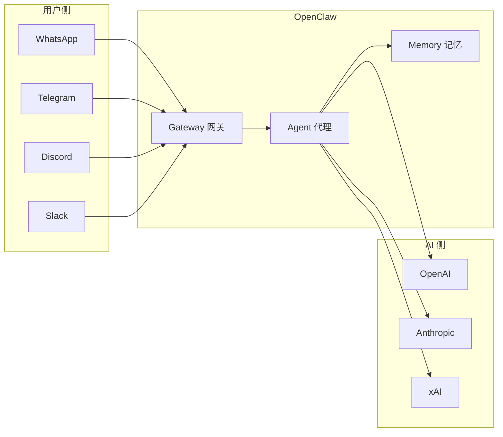
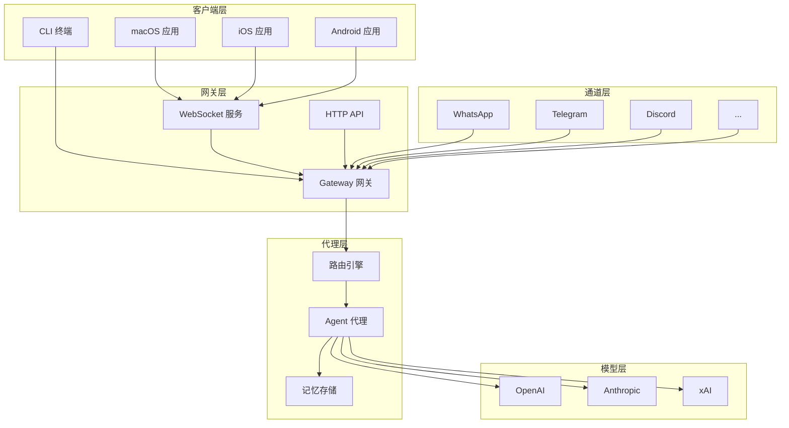
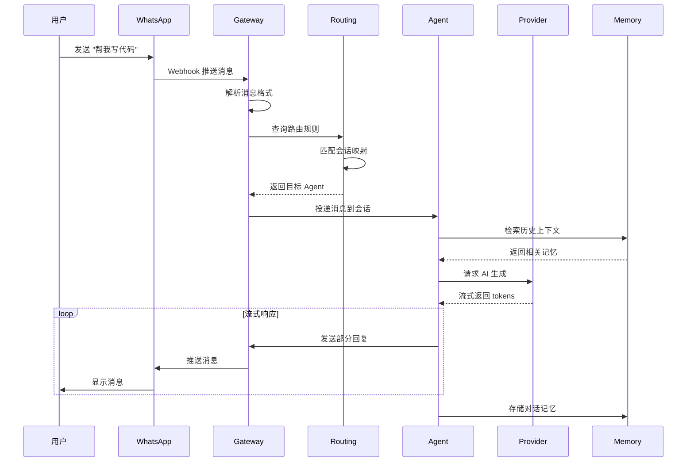

> **学习目标**：理解 OpenClaw 的核心定位、解决的问题、技术架构概览
> **前置知识**：基础编程概念、了解即时通讯和 AI 基本概念
> **源码路径**：`/` (项目根目录)
> **阅读时间**：15分钟

---

OpenClaw 是一个**个人 AI 助手网关**。它作为中心控制平面，将各种消息通道连接起来，并将消息路由给 AI 智能体进行处理。

## 1.1 解决什么问题

### 现实痛点

假设你是开发者，想要：

1. **统一接入多个 IM 平台** - 用户可能通过 WhatsApp、Telegram、Discord 等不同平台联系你
2. **集中管理 AI 对话** - 不想在每个平台单独配置 AI，希望有一个中心化的智能助手
3. **保持数据隐私** - 不想将对话数据托管给第三方 SaaS 服务
4. **自定义扩展能力** - 希望能快速接入新的消息通道或 AI 模型

传统方案需要：

- 为每个 IM 平台单独开发 Bot
- 在每个平台配置 AI API
- 数据分散在各平台，难以统一管理
- 扩展新平台成本高

### OpenClaw 的解决方案

**核心价值**：

| 特性 | 说明 |
|------|------|
| **统一入口** | 20+ 消息平台通过统一接口接入 |
| **本地优先** | 数据完全掌握在自己手中 |
| **灵活路由** | 支持基于规则、上下文的消息路由 |
| **可扩展** | Plugin SDK 支持自定义通道和工具 |
| **多模型** | 支持 30+ AI 提供商 |

## 1.2 整体架构

### 架构分层

### 核心组件说明

| 组件 | 目录 | 职责 |
|------|------|------|
| **Gateway** | `src/gateway/` | 消息网关，处理连接、认证、消息分发 |
| **Agent** | `src/agents/` | AI 代理，管理会话、调用 LLM、执行工具 |
| **Channel** | `src/channels/`, `extensions/` | 消息通道抽象，接入各 IM 平台 |
| **Provider** | `src/providers/`, `extensions/` | AI 提供商抽象，封装各 LLM API |
| **Routing** | `src/routing/` | 消息路由，决定消息如何分发 |
| **Memory** | `src/memory/` | 长期记忆，向量存储和检索 |
| **Plugin SDK** | `src/plugin-sdk/` | 扩展开发工具包 |

## 1.3 一条消息的生命周期

让我们追踪一条消息从用户发送到收到回复的完整流程：

### 关键步骤详解

**1. 消息接收** (`extensions/whatsapp/src/channel.ts`)
- WhatsApp 通过 Webhook 推送用户消息
- Channel 负责解析平台特定的消息格式
- 转换为 OpenClaw 统一的消息结构

**2. 网关处理** (`src/gateway/`)
- 验证消息来源和权限
- 解析消息协议
- 投递到路由引擎

**3. 路由决策** (`src/routing/`)
- 根据消息来源、内容、用户配置决定目标 Agent
- 支持基于规则、基于上下文的灵活路由

**4. Agent 处理** (`src/agents/`)
- 管理会话状态
- 调用 Memory 检索相关上下文
- 构造 Prompt 调用 LLM

**5. AI 生成** (`src/providers/`, `extensions/`)
- 封装各 LLM API 的调用细节
- 处理流式响应
- 统一返回格式

**6. 回复推送**
- Agent 生成回复后原路返回
- 支持流式推送，用户体验更好

## 1.4 技术栈概览

### 核心技术栈

| 层级 | 技术 | 说明 |
|------|------|------|
| **语言** | TypeScript 5.x | 类型安全，开发体验好 |
| **运行时** | Node.js 22+ | 最新 LTS 版本 |
| **框架** | Hono | 轻量级 Web 框架 |
| **构建** | tsdown | 快速打包工具 |
| **测试** | Vitest | Vite 生态测试框架 |

### 平台技术栈

| 平台 | 技术 | 说明 |
|------|------|------|
| **macOS** | Swift, SwiftUI, AppKit | 原生应用 |
| **iOS** | Swift, SwiftUI | 原生应用 |
| **Android** | Kotlin | 原生应用 |
| **CLI** | TypeScript | 终端界面 |

### 通信协议

| 协议 | 用途 |
|------|------|
| **WebSocket** | 客户端与 Gateway 实时通信 |
| **HTTP** | REST API、Webhook 接收 |
| **JSON** | 消息序列化格式 |

## 1.5 与类似项目的对比

| 特性 | OpenClaw | LangChain | Botpress | 自建 |
|------|----------|-----------|----------|------|
| **本地部署** | ✅ 完全本地 | ⚠️ 需自行部署 | ⚠️ 云端为主 | ✅ |
| **多平台支持** | ✅ 20+ | ❌ 需自行集成 | ✅ 部分平台 | ❌ 需逐个开发 |
| **AI 多模型** | ✅ 30+ | ✅ 多模型 | ✅ 多模型 | ⚠️ 需逐个集成 |
| **可扩展性** | ✅ Plugin SDK | ✅ Chains | ⚠️ 插件系统 | ❌ |
| **跨平台客户端** | ✅ iOS/Android/macOS | ❌ | ❌ | ❌ |
| **学习曲线** | 中等 | 陡峭 | 中等 | 低 |

## 1.6 适合谁学习

### 目标读者画像

**刚上大学的学生**
- 有基础编程能力
- 想学习大型项目架构
- 对 AI 应用感兴趣

**转行工程师**
- 熟悉语法但不熟悉架构
- 想了解生产级代码组织
- 需要参考设计模式

**开源贡献者**
- 想快速理解项目结构
- 需要定位代码位置
- 希望提交有效 PR

### 阅读本书你将学到

- ✅ 大型 TypeScript 项目的架构设计
- ✅ 消息网关的实现原理
- ✅ AI 代理的会话管理
- ✅ 多平台消息抽象层设计
- ✅ 插件系统架构
- ✅ 跨平台客户端开发

## 1.7 本章小结

本章介绍了 OpenClaw 的核心定位和整体架构。关键要点：

1. **定位**：个人 AI 助手网关，统一管理多个 IM 平台的 AI 对话
2. **架构**：Gateway（网关）→ Routing（路由）→ Agent（代理）→ Provider（提供商）
3. **价值**：本地优先、多平台支持、可扩展、多模型
4. **技术栈**：TypeScript + Node.js 22 + Hono

下一章我们将深入项目结构，了解每个目录的职责和模块划分。

---

**延伸阅读**：
- [官方文档](https://docs.openclaw.ai)
- [GitHub 仓库](https://github.com/openclaw/openclaw)
