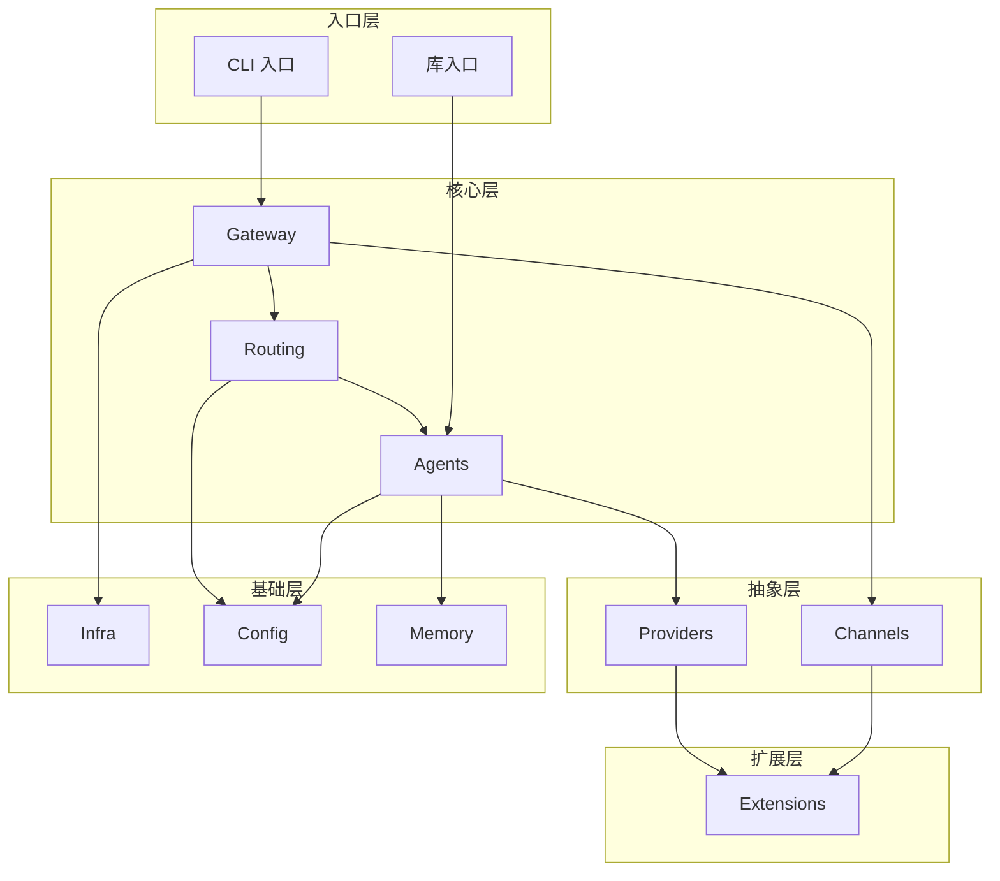

> **学习目标**：掌握项目的目录结构，理解各模块的职责和依赖关系
> **前置知识**：第1章：OpenClaw 是什么
> **源码路径**：`/` (项目根目录)
> **阅读时间**：20分钟

---

<SourceSnapshotCard
  repo="openclaw/openclaw"
  branch="main"
  verified-at="2026-03-17"
  :entries="[
    { label: '核心源码', path: 'src/' },
    { label: '扩展系统', path: 'extensions/' },
    { label: '跨平台应用', path: 'apps/' },
    { label: 'CLI 入口', path: 'src/entry.ts' },
    { label: '库入口', path: 'src/index.ts' }
  ]"
/>

## 2.1 顶层目录结构

```
openclaw/
├── src/                    # 核心源码
├── extensions/             # 扩展插件
├── apps/                   # 跨平台应用
├── docs/                   # 文档源文件
├── .pi/                    # 内部工具
├── vendor/                 # 第三方依赖
├── openclaw.mjs            # CLI 入口脚本
├── package.json            # 项目配置
├── pnpm-workspace.yaml     # Monorepo 配置
├── tsconfig.json           # TypeScript 配置
├── vitest.config.ts        # 测试配置
└── Dockerfile              # 容器化配置
```

### 关键目录说明

| 目录 | 职责 | 重要程度 |
|------|------|----------|
| `src/` | 核心运行时代码 | ⭐⭐⭐⭐⭐ |
| `extensions/` | 可选扩展插件 | ⭐⭐⭐⭐ |
| `apps/` | 跨平台客户端 | ⭐⭐⭐⭐ |
| `docs/` | 文档源文件 | ⭐⭐ |
| `vendor/` | 第三方依赖 | ⭐ |

## 2.2 核心源码结构 (src/)

```
src/
├── gateway/              # 核心消息网关 ⭐⭐⭐⭐⭐
│   ├── protocol/         # 通信协议定义
│   └── client.ts         # 客户端连接管理
├── agents/               # AI 代理层 ⭐⭐⭐⭐⭐
│   ├── cli-runner.ts     # CLI 运行器
│   ├── cli-session.ts    # 会话管理
│   └── cli-backends.ts   # 后端适配
├── channels/             # 消息通道抽象 ⭐⭐⭐⭐
├── providers/            # AI 提供商抽象 ⭐⭐⭐⭐
├── routing/              # 消息路由逻辑 ⭐⭐⭐⭐
├── plugin-sdk/           # 插件开发 SDK ⭐⭐⭐⭐
├── memory/               # 记忆存储 ⭐⭐⭐
├── cli/                  # 命令行界面 ⭐⭐⭐
│   └── program/          # 子命令注册
├── infra/                # 基础设施 ⭐⭐⭐
├── config/               # 配置管理 ⭐⭐⭐
├── tui/                  # 终端用户界面 ⭐⭐
├── types/                # TypeScript 类型 ⭐⭐
├── utils/                # 工具函数 ⭐⭐
├── entry.ts              # CLI 入口 ⭐⭐⭐⭐⭐
├── index.ts              # 库入口 ⭐⭐⭐⭐
└── library.ts            # 公共 API 导出 ⭐⭐⭐
```

### 模块职责详解

#### gateway/ - 核心网关

**职责**：
- WebSocket 连接管理
- 消息协议解析
- 认证和授权
- 消息路由分发

**关键文件**：
- `client.ts` - 客户端连接管理
- `protocol/` - 通信协议定义

**依赖关系**：
```
gateway
  ├── routing (路由决策)
  ├── agents (消息处理)
  ├── channels (消息收发)
  └── infra (底层支持)
```

#### agents/ - AI 代理

**职责**：
- 会话生命周期管理
- LLM 调用和流式响应
- 工具执行
- 对话历史维护

**关键文件**：
- `cli-runner.ts` - 代理运行器
- `cli-session.ts` - 会话状态管理
- `cli-backends.ts` - 后端适配器

#### channels/ - 消息通道

**职责**：
- 定义统一的通道接口
- 内置通道实现
- 通道注册和管理

**设计模式**：策略模式 + 适配器模式

#### providers/ - AI 提供商

**职责**：
- 封装不同 LLM API
- 统一的调用接口
- 流式响应处理

#### routing/ - 消息路由

**职责**：
- 消息路由规则
- 会话映射
- 优先级管理

## 2.3 扩展系统结构 (extensions/)

```
extensions/
├── zalo/                 # Zalo 通道
├── whatsapp/             # WhatsApp 通道
├── mattermost/           # Mattermost 通道
├── zai/                  # Z.AI 提供者
├── xai/                  # xAI 提供者
├── mistral/              # Mistral 提供者
├── xiaomi/               # 小米 AI 提供者
├── firecrawl/            # 网页抓取工具
├── memory-lancedb/       # LanceDB 记忆工具
└── ...                   # 更多扩展
```

### 扩展类型

| 类型 | 说明 | 示例 |
|------|------|------|
| **Channel** | 消息通道 | `zalo`, `whatsapp`, `mattermost` |
| **Provider** | AI 提供者 | `zai`, `xai`, `mistral`, `xiaomi` |
| **Tool** | 独立工具 | `firecrawl`, `memory-lancedb` |

### 扩展目录结构

```
extensions/<name>/
├── package.json           # 依赖声明
├── openclaw.plugin.json   # 插件元数据
├── index.ts               # 入口文件
├── src/
│   ├── channel.ts         # 通道实现（如适用）
│   ├── provider.ts        # 提供者实现（如适用）
│   └── tool.ts            # 工具实现（如适用）
└── README.md              # 说明文档
```

## 2.4 跨平台应用结构 (apps/)

```
apps/
├── macos/                 # macOS 应用
│   └── Sources/
│       ├── OpenClaw/      # 主应用
│       ├── OpenClawDiscovery/  # Bonjour 发现
│       ├── OpenClawIPC/   # 进程间通信
│       └── OpenClawMacCLI/  # 命令行工具
├── ios/                   # iOS 应用
│   ├── Sources/           # Swift 源码
│   ├── ShareExtension/    # 分享扩展
│   ├── WatchApp/          # watchOS 应用
│   └── ActivityWidget/    # 小组件
├── android/               # Android 应用
│   └── app/
│       └── src/main/java/com/openclaw/android/
└── shared/
    └── OpenClawKit/       # 跨平台共享库 ⭐⭐⭐⭐⭐
        └── Sources/
            └── OpenClawKit/
                ├── GatewayNodeSession.swift  # Gateway 连接
                ├── GatewayPush.swift         # 推送处理
                └── CameraCommands.swift      # 设备能力
```

### OpenClawKit - 共享库

**核心功能**：
- WebSocket 连接管理
- Gateway 协议编解码
- 设备能力抽象（相机、定位等）

**支持平台**：
- macOS (AppKit)
- iOS (UIKit/SwiftUI)
- watchOS
- Android (通过协议文档)

## 2.5 入口文件分析

### CLI 入口 (src/entry.ts)

```typescript
// 简化示意
import { program } from './cli/program'

// 处理命令行参数
const args = process.argv.slice(2)

// 检查 Node 版本
if (process.version < requiredVersion) {
  console.error('需要 Node.js 22+')
  process.exit(1)
}

// 启动 CLI
program.parse(args)
```

**执行流程**：
1. 检查 Node.js 版本
2. 解析命令行参数
3. 加载配置
4. 注册子命令
5. 执行对应命令

### 库入口 (src/index.ts)

```typescript
// 导出公共 API
export * from './library'

// 遗留 CLI 入口（向后兼容）
export { runLegacyCliEntry } from './cli/legacy'
```

## 2.6 模块依赖关系图



### 依赖规则

1. **入口层** 依赖 **核心层**
2. **核心层** 依赖 **抽象层** 和 **基础层**
3. **抽象层** 依赖 **基础层**
4. **扩展层** 通过 Plugin SDK 接入核心

## 2.7 配置文件解析

### package.json 关键字段

```json
{
  "name": "openclaw",
  "version": "1.0.0",
  "type": "module",
  "bin": {
    "openclaw": "./openclaw.mjs"
  },
  "main": "./dist/index.js",
  "exports": {
    ".": "./dist/index.js",
    "./plugin-sdk/core": "./dist/plugin-sdk/core.js",
    "./plugin-sdk/zalo": "./dist/plugin-sdk/zalo.js"
  },
  "engines": {
    "node": ">=22"
  }
}
```

**说明**：
- `bin` - CLI 命令入口
- `main` - 库导入入口
- `exports` - 模块导出映射
- `engines` - Node 版本要求

### pnpm-workspace.yaml

```yaml
packages:
  - 'src'
  - 'extensions/*'
  - 'apps/*'
```

**说明**：Monorepo 配置，管理多个包

## 2.8 本章小结

本章深入分析了 OpenClaw 的项目结构。关键要点：

1. **三层架构**：入口层 → 核心层 → 基础层
2. **核心模块**：gateway、agents、channels、providers、routing
3. **扩展系统**：extensions/ 目录下的独立插件
4. **跨平台**：apps/ 目录下的平台应用 + 共享 OpenClawKit
5. **入口文件**：entry.ts (CLI) 和 index.ts (库)

下一章我们将学习核心概念，为理解各模块的实现打下基础。

---

**延伸阅读**：
- [第3章：核心概念](/02-concepts/)
- [第4章：Gateway 网关](/03-gateway/)
