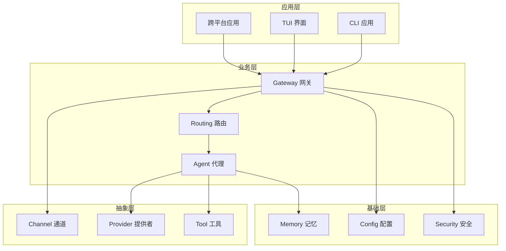
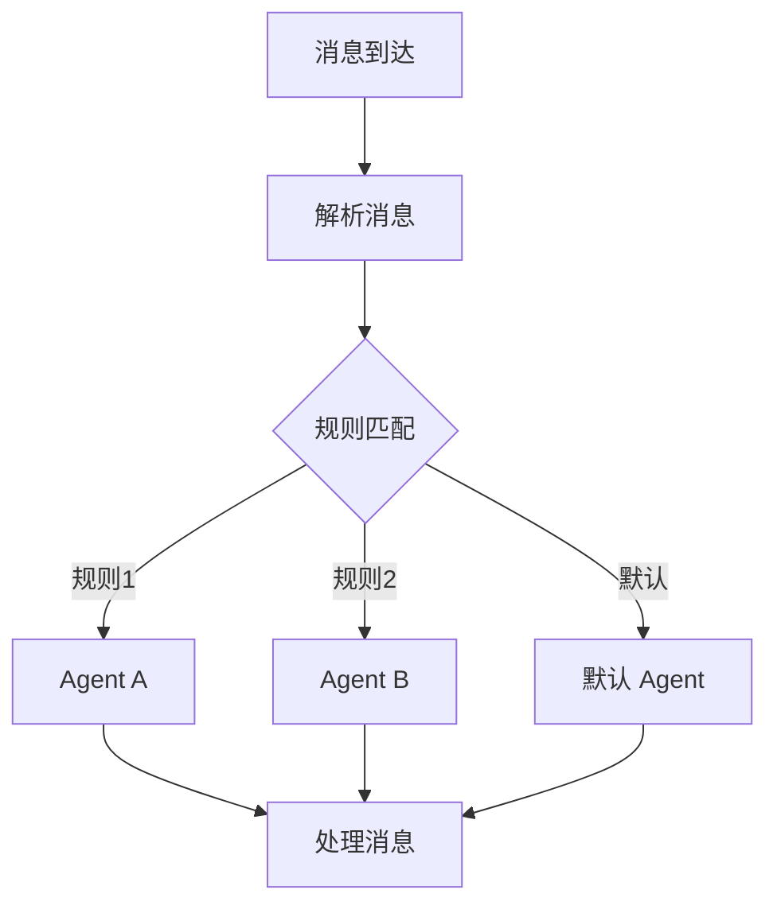
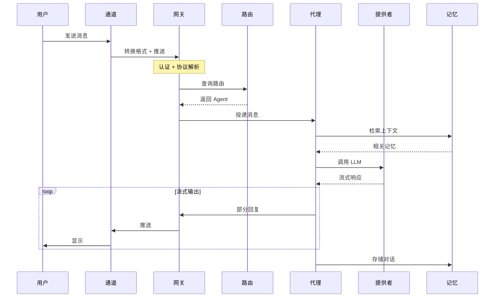
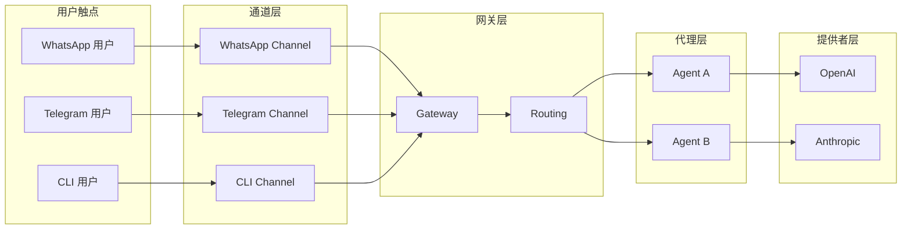
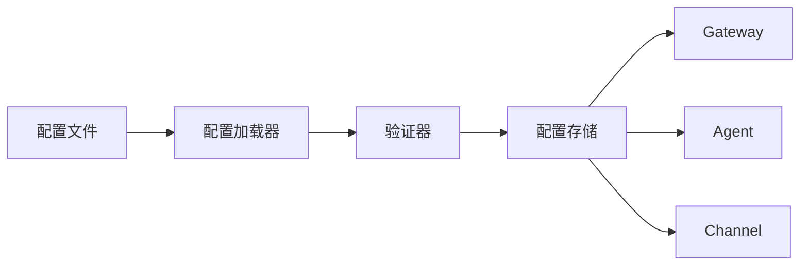
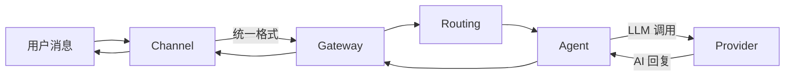
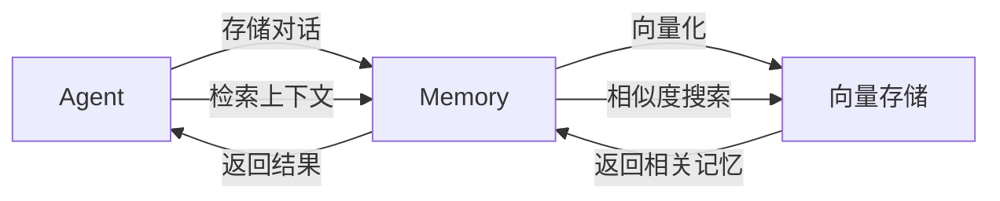

> **学习目标**：掌握 OpenClaw 的核心概念、术语定义、设计模式
> **前置知识**：第1章、第2章
> **源码路径**：`src/types/`, `src/plugin-sdk/`
> **阅读时间**：25分钟

---

本章将建立 OpenClaw 的概念模型，帮助你在阅读后续章节时快速定位和理解代码。

## 3.1 核心抽象层次

OpenClaw 采用分层抽象设计，每层只关心特定职责：



### 层次职责

| 层次 | 职责 | 示例组件 |
|------|------|----------|
| **应用层** | 用户交互入口 | CLI、TUI、移动应用 |
| **业务层** | 核心业务逻辑 | Gateway、Agent、Routing |
| **抽象层** | 平台/服务抽象 | Channel、Provider、Tool |
| **基础层** | 通用能力支撑 | Memory、Config、Security |

## 3.2 核心概念详解

### Gateway（网关）

**定义**：消息路由中心，负责连接管理、协议解析、消息分发。

**核心职责**：
1. **连接管理** - 维护客户端和通道的 WebSocket 连接
2. **认证授权** - 验证连接身份，控制访问权限
3. **协议解析** - 解析消息格式，统一数据结构
4. **消息路由** - 将消息分发到正确的 Agent

**关键接口**：

```typescript
// 简化的 Gateway 接口
interface Gateway {
  // 启动网关服务
  start(config: GatewayConfig): Promise<void>
  
  // 停止网关服务
  stop(): Promise<void>
  
  // 注册消息处理器
  onMessage(handler: MessageHandler): void
  
  // 发送消息到客户端
  send(clientId: string, message: Message): Promise<void>
}
```

**代码位置**：`src/gateway/`

---

### Agent（代理）

**定义**：AI 代理是处理用户消息的核心单元，负责调用 LLM、管理会话、执行工具。

**核心职责**：
1. **会话管理** - 创建、维护、销毁会话
2. **LLM 调用** - 构造 Prompt，调用 AI 模型
3. **工具执行** - 执行 AI 请求的工具调用
4. **历史维护** - 管理对话上下文

**关键接口**：

```typescript
// 简化的 Agent 接口
interface Agent {
  // 处理用户消息
  handleMessage(sessionId: string, message: Message): Promise<Response>
  
  // 执行工具
  executeTool(toolName: string, params: any): Promise<any>
  
  // 管理会话
  createSession(config: SessionConfig): Promise<Session>
  destroySession(sessionId: string): Promise<void>
}
```

**代码位置**：`src/agents/`

---

### Channel（通道）

**定义**：消息通道是对不同 IM 平台的统一抽象，每个 Channel 实现特定平台的消息收发。

**核心职责**：
1. **消息接收** - 从平台接收消息（Webhook、长连接等）
2. **消息发送** - 向平台发送消息
3. **格式转换** - 平台格式 ↔ OpenClaw 格式
4. **事件处理** - 处理平台特有事件

**关键接口**：

```typescript
// 简化的 Channel 接口
interface Channel {
  // 通道标识
  id: string
  name: string
  
  // 初始化
  initialize(config: ChannelConfig): Promise<void>
  
  // 发送消息
  sendMessage(chatId: string, message: Message): Promise<void>
  
  // 注册消息回调
  onMessage(callback: (message: Message) => void): void
  
  // 销毁
  destroy(): Promise<void>
}
```

**代码位置**：`src/channels/`, `extensions/*/src/channel.ts`

---

### Provider（提供商）

**定义**：AI 提供商是对不同 LLM 服务的统一抽象，每个 Provider 实现特定 AI 服务的调用接口。

**核心职责**：
1. **API 封装** - 封装不同 LLM 的 API 调用
2. **认证管理** - 管理 API Key、OAuth 等认证方式
3. **流式响应** - 处理流式输出
4. **错误处理** - 统一错误格式

**关键接口**：

```typescript
// 简化的 Provider 接口
interface Provider {
  // 提供商标识
  id: string
  name: string
  
  // 认证方法
  authMethods: ProviderAuthMethod[]
  
  // 聊天补全
  chatCompletion(
    messages: Message[],
    options: ChatOptions
  ): Promise<ChatResponse>
  
  // 流式聊天
  streamChatCompletion(
    messages: Message[],
    options: ChatOptions
  ): AsyncIterable<ChatChunk>
  
  // 获取可用模型
  listModels(): Promise<Model[]>
}
```

**代码位置**：`src/providers/`, `extensions/*/src/provider.ts`

---

### Routing（路由）

**定义**：消息路由决定来自某 Channel 的消息应发给哪个 Agent 处理。

**路由规则类型**：
1. **基于规则** - 根据消息内容、来源匹配
2. **基于上下文** - 根据会话历史、用户偏好
3. **优先级** - 多规则时按优先级选择

**路由决策流程**：



**代码位置**：`src/routing/`

---

### Memory（记忆）

**定义**：长期记忆存储系统，基于向量数据库，为 Agent 提供上下文检索能力。

**核心职责**：
1. **存储对话** - 持久化对话历史
2. **向量化** - 将文本转换为向量
3. **语义检索** - 基于相似度检索相关记忆
4. **遗忘策略** - 自动清理过期记忆

**关键接口**：

```typescript
// 简化的 Memory 接口
interface Memory {
  // 存储记忆
  store(sessionId: string, content: string, metadata?: any): Promise<void>
  
  // 检索相关记忆
  recall(sessionId: string, query: string, limit?: number): Promise<Memory[]>
  
  // 清理记忆
  forget(sessionId: string): Promise<void>
}
```

**代码位置**：`src/memory/`, `extensions/memory-lancedb/`

---

### Plugin SDK

**定义**：插件开发工具包，提供扩展开发所需的类型定义和辅助函数。

**核心导出**：

```typescript
// 从 openclaw/plugin-sdk/core 导出
export interface OpenClawPlugin {
  id: string
  name: string
  description?: string
  configSchema?: ConfigSchema
  register(api: OpenClawPluginApi): Promise<void> | void
}

export interface OpenClawPluginApi {
  registerChannel(channel: ChannelPlugin): void
  registerProvider(provider: ProviderPlugin): void
  registerWebSearchProvider(provider: WebSearchProvider): void
  // ... 更多 API
}
```

**代码位置**：`src/plugin-sdk/`

## 3.3 消息流转模型

### 消息类型

```typescript
// 简化的消息类型
interface Message {
  id: string
  type: 'text' | 'image' | 'audio' | 'file'
  content: string
  sender: User
  chat: Chat
  timestamp: number
  metadata?: Record<string, any>
}
```

### 消息流转图



## 3.4 设计模式

### 策略模式 - Channel/Provider

不同平台和模型通过策略模式统一接口：

```typescript
// 策略接口
interface MessageStrategy {
  send(message: Message): Promise<void>
  receive(): AsyncIterable<Message>
}

// 具体策略
class WhatsAppChannel implements MessageStrategy { ... }
class TelegramChannel implements MessageStrategy { ... }

// 上下文
class ChannelManager {
  private strategies: Map<string, MessageStrategy>
  
  send(channelId: string, message: Message) {
    return this.strategies.get(channelId).send(message)
  }
}
```

### 工厂模式 - Provider 创建

```typescript
// 工厂
class ProviderFactory {
  static create(config: ProviderConfig): Provider {
    switch (config.type) {
      case 'openai':
        return new OpenAIProvider(config)
      case 'anthropic':
        return new AnthropicProvider(config)
      // ...
    }
  }
}
```

### 观察者模式 - 事件系统

```typescript
// 事件发射器
class EventEmitter<T extends Record<string, any>> {
  private listeners: Map<keyof T, Set<Function>>
  
  on<K extends keyof T>(event: K, handler: (data: T[K]) => void) { ... }
  emit<K extends keyof T>(event: K, data: T[K]) { ... }
}

// 使用
gateway.on('message', (msg) => { ... })
gateway.emit('message', message)
```

### 适配器模式 - 平台适配

```typescript
// 适配器
class WhatsAppAdapter implements Channel {
  private client: WhatsAppClient  // 第三方库
  
  async sendMessage(chatId: string, message: Message) {
    // 适配 WhatsApp API
    await this.client.sendMessage(chatId, this.toWhatsAppFormat(message))
  }
  
  private toWhatsAppFormat(message: Message): WhatsAppMessage {
    // 格式转换
  }
}
```

## 3.5 概念关系图



## 3.6 数据流概览

### 配置数据流



### 消息数据流



### 记忆数据流



## 3.7 本章小结

本章建立了 OpenClaw 的核心概念模型。关键要点：

1. **四层架构**：应用层 → 业务层 → 抽象层 → 基础层
2. **核心概念**：Gateway、Agent、Channel、Provider、Routing、Memory
3. **设计模式**：策略模式、工厂模式、观察者模式、适配器模式
4. **数据流向**：配置流、消息流、记忆流

下一章我们将深入 Gateway 网关的实现细节。

---

**延伸阅读**：
- [第4章：Gateway 网关](/03-gateway/)
- [术语表](/glossary)
