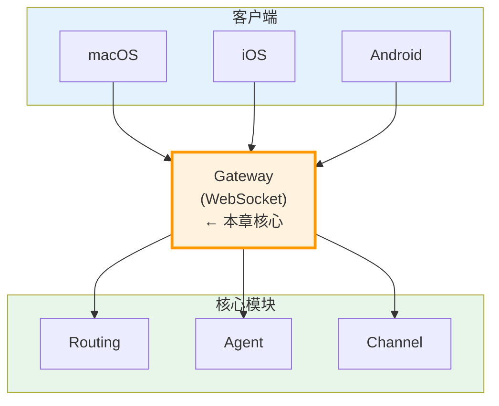

> **学习目标**：理解 Gateway 如何作为 OpenClaw 的核心枢纽，管理 WebSocket 连接、解析消息协议、协调消息流转
> **前置知识**：第1-3章（项目概览、结构、核心概念）
> **源码路径**：`src/gateway/`
> **阅读时间**：45分钟

<SourceSnapshotCard
  repo="openclaw/openclaw"
  branch="main"
  commit="latest"
  verified-at="2024-03"
  :entries="[
    { label: 'Gateway 入口', path: 'src/gateway/' },
    { label: 'WebSocket 管理', path: 'src/gateway/client.ts' }
  ]"
/>

## 4.1 概念引入

### 4.1.1 为什么需要 Gateway？

OpenClaw 作为个人 AI 助手网关，需要连接 **20+ 消息平台**（微信、Telegram、Discord 等）。每个平台都有不同的：
- 连接方式（WebSocket、HTTP、长轮询）
- 消息格式（JSON、XML、私有协议）
- 认证机制（Token、OAuth、签名）

**Gateway 的职责**：统一处理这些差异，为上层提供一致的接口。

### 4.1.2 Gateway 在架构中的位置



### 4.1.3 Gateway 的核心职责

| 职责 | 说明 |
|------|------|
| **连接管理** | 维护与客户端的 WebSocket 连接 |
| **协议解析** | 解析客户端发送的 JSON 消息 |
| **消息路由** | 将消息分发到正确的处理模块 |
| **状态同步** | 推送状态变更给客户端 |
| **认证授权** | 验证客户端身份 |

## 4.2 核心数据结构

### 4.2.1 Gateway 消息类型

```typescript
// src/gateway/types.ts (概念示意)

interface GatewayMessage {
  type: MessageType;      // 消息类型
  id: string;             // 消息 ID
  timestamp: number;      // 时间戳
  payload: unknown;       // 消息负载
}

enum MessageType {
  // 连接管理
  CONNECT = 'connect',
  DISCONNECT = 'disconnect',
  PING = 'ping',
  PONG = 'pong',
  
  // 消息处理
  CHAT = 'chat',          // 聊天消息
  COMMAND = 'command',    // 命令消息
  EVENT = 'event',        // 事件消息
  
  // 状态同步
  STATE_UPDATE = 'state_update',
  CHANNEL_UPDATE = 'channel_update'
}
```

### 4.2.2 客户端连接状态

```typescript
interface ClientConnection {
  id: string;                    // 连接 ID
  deviceId: string;              // 设备 ID
  platform: 'macos' | 'ios' | 'android';
  connectedAt: number;           // 连接时间
  lastActivity: number;          // 最后活动时间
  subscriptions: string[];       // 订阅的消息通道
}
```

## 4.3 代码路径追踪

> **任务**：用户从 macOS 客户端发送一条聊天消息，Gateway 如何处理？

### 第一步：WebSocket 连接建立

```
客户端发起 WebSocket 连接
        ↓
Gateway 接受连接
        ↓
验证设备身份（deviceId, token）
        ↓
创建 ClientConnection 实例
        ↓
返回 CONNECT_ACK
```

### 第二步：消息接收与解析

```
客户端发送消息 (WebSocket frame)
        ↓
Gateway 接收原始数据
        ↓
解析 JSON 消息
        ↓
验证消息格式
        ↓
创建 GatewayMessage 对象
```

### 第三步：消息路由

```
GatewayMessage
        ↓
根据 type 字段路由
        ↓
┌───────┼───────┐
│       │       │
CHAT  COMMAND EVENT
 │       │       │
 ↓       ↓       ↓
Agent  Routing Channel
```

### 第四步：响应推送

```
处理结果
        ↓
构建响应消息
        ↓
序列化为 JSON
        ↓
通过 WebSocket 发送给客户端
```

## 4.4 与其他模块的交互

### 4.4.1 Gateway ↔ Routing

```
Gateway                      Routing
   │                            │
   │  1. 收到 CHAT 消息         │
   │  2. 调用 Routing.route()   │
   │ ─────────────────────────►│
   │                            │
   │  3. Routing 返回目标       │
   │ ◄───────────────────────── │
   │                            │
   │  4. 将消息转发给目标模块    │
```

### 4.4.2 Gateway ↔ Agent

```
Gateway                      Agent
   │                            │
   │  1. 收到需要 AI 处理的消息  │
   │  2. 调用 Agent.process()   │
   │ ─────────────────────────►│
   │                            │
   │  3. Agent 调用 LLM         │
   │                            │
   │  4. 返回 AI 响应           │
   │ ◄───────────────────────── │
   │                            │
   │  5. 推送给客户端           │
```

### 4.4.3 Gateway ↔ Channel

```
Gateway                      Channel
   │                            │
   │  1. 收到外部平台消息        │
   │ ◄───────────────────────── │
   │                            │
   │  2. 标准化消息格式          │
   │                            │
   │  3. 路由到 Agent 处理       │
```

## 4.5 常见修改场景

### 4.5.1 添加新的消息类型

1. 在 `types.ts` 中定义新的 MessageType
2. 在 `handler.ts` 中添加处理逻辑
3. 更新路由规则

### 4.5.2 实现消息压缩

1. 在 WebSocket 配置中启用压缩
2. 修改消息序列化逻辑
3. 添加压缩/解压缩中间件

### 4.5.3 添加连接限流

1. 实现连接计数器
2. 在连接建立前检查限制
3. 超限时返回错误消息

## 4.6 概念→代码映射表

| 概念组件 | 对应目录/文件 | 核心作用 |
|---------|-------------|---------|
| **WebSocket 服务器** | `src/gateway/server.ts` | 监听连接、管理生命周期 |
| **客户端管理** | `src/gateway/client.ts` | 连接状态、设备信息 |
| **消息解析** | `src/gateway/parser.ts` | JSON 解析、格式验证 |
| **消息路由** | `src/gateway/router.ts` | 分发消息到目标模块 |
| **协议定义** | `src/gateway/types.ts` | 类型定义、枚举 |

## 4.7 小结

Gateway 是 OpenClaw 的**核心枢纽**，承担着：
- 连接管理：与客户端建立稳定的双向通信
- 协议解析：将不同格式的消息统一处理
- 消息路由：将消息分发到正确的处理模块

理解 Gateway 是理解整个系统的关键，后续章节将深入 Routing、Agent、Channel 等模块，它们都与 Gateway 紧密协作。

---

**下一章**：[第5章：Agent 代理](/04-agent/) - 了解 OpenClaw 如何与 AI 模型交互
