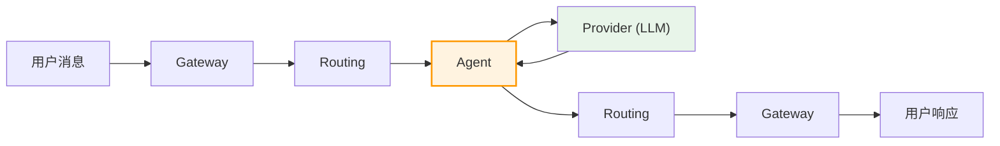
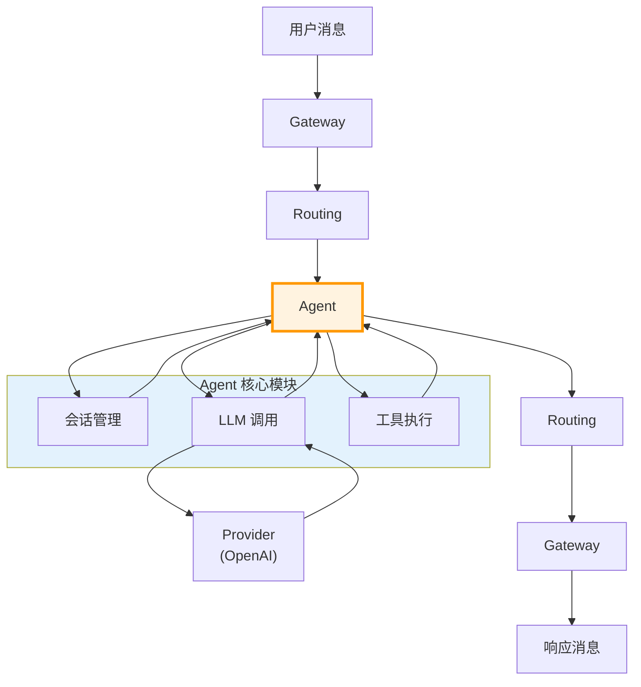

> **学习目标**：理解 Agent 如何管理 AI 会话、调用 LLM、执行任务
> **前置知识**：第1-4章（项目概览到 Gateway）
> **源码路径**：`src/agents/`
> **阅读时间**：50分钟

<SourceSnapshotCard
  repo="openclaw/openclaw"
  branch="main"
  commit="latest"
  verified-at="2024-03"
  :entries="[
    { label: 'Agent 入口', path: 'src/agents/' },
    { label: '会话管理', path: 'src/agents/session.ts' }
  ]"
/>

## 5.1 概念引入

### 5.1.1 Agent 是什么？

在 OpenClaw 中，**Agent 是 AI 的"大脑"**。当用户发送一条消息：



Agent 负责：
- **会话管理**：维护对话上下文
- **LLM 调用**：选择合适的模型、构建 prompt
- **任务执行**：调用工具、处理函数调用

### 5.1.2 Agent 在架构中的位置



### 5.1.3 Agent 的核心职责

| 职责 | 说明 |
|------|------|
| **上下文管理** | 维护对话历史、管理 token 限制 |
| **模型选择** | 根据任务选择合适的 LLM |
| **Prompt 构建** | 组装 system prompt、历史消息 |
| **工具调用** | 解析函数调用、执行工具、返回结果 |
| **流式响应** | 支持 SSE 流式输出 |

## 5.2 核心数据结构

### 5.2.1 会话（Session）

```typescript
// src/agents/session.ts (概念示意)

interface Session {
  id: string;                    // 会话 ID
  userId: string;                // 用户 ID
  channelId: string;             // 消息通道 ID
  
  // 对话历史
  messages: Message[];           // 消息列表
  
  // 配置
  model: string;                 // 当前使用的模型
  systemPrompt?: string;         // 系统提示词
  
  // 元数据
  createdAt: number;             // 创建时间
  updatedAt: number;             // 更新时间
  metadata: Record<string, unknown>; // 扩展数据
}

interface Message {
  role: 'system' | 'user' | 'assistant' | 'tool';
  content: string;
  name?: string;                 // 工具调用时的工具名
  toolCallId?: string;           // 工具调用 ID
  timestamp: number;
}
```

### 5.2.2 Agent 上下文

```typescript
interface AgentContext {
  session: Session;              // 当前会话
  provider: Provider;            // LLM 提供者
  tools: Tool[];                 // 可用工具
  memory: Memory;                // 记忆存储
  
  // 运行时状态
  currentMessage: Message;       // 当前处理的消息
  streamCallback?: Function;     // 流式回调
}
```

## 5.3 代码路径追踪

> **任务**：用户发送"帮我查一下今天北京天气"，Agent 如何处理？

### 第一步：接收消息

```
Routing 确定目标 Agent
        ↓
创建/获取 Session
        ↓
构建 AgentContext
        ↓
调用 Agent.process(message)
```

### 第二步：构建 Prompt

```
获取 System Prompt
        ↓
加载历史消息
        ↓
添加当前用户消息
        ↓
计算 Token 数量
        ↓
截断/压缩历史（如需要）
```

### 第三步：调用 LLM

```
选择 Provider
        ↓
构建 API 请求
        ↓
发送请求（流式/非流式）
        ↓
接收响应
```

### 第四步：处理工具调用

```
检测 Function Call
        ↓
查找对应工具
        ↓
执行工具
        ↓
将结果加入对话历史
        ↓
重新调用 LLM
```

### 第五步：返回响应

```
组装响应消息
        ↓
更新 Session
        ↓
返回给 Routing
        ↓
Gateway 推送给客户端
```

## 5.4 与其他模块的交互

### 5.4.1 Agent ↔ Provider

```
Agent                        Provider
   │                            │
   │  1. 选择模型               │
   │  2. 构建请求               │
   │ ─────────────────────────►│
   │                            │
   │                            │  3. 调用 LLM API
   │                            │
   │  4. 返回响应（流式）       │
   │ ◄───────────────────────── │
   │                            │
   │  5. 处理响应               │
```

### 5.4.2 Agent ↔ Memory

```
Agent                        Memory
   │                            │
   │  1. 存储对话历史           │
   │ ─────────────────────────►│
   │                            │
   │  2. 检索相关记忆           │
   │ ◄───────────────────────── │
   │                            │
   │  3. 增强上下文             │
```

### 5.4.3 Agent ↔ Tools

```
Agent                        Tool
   │                            │
   │  1. LLM 返回 Function Call │
   │  2. 查找工具定义           │
   │  3. 执行工具               │
   │ ─────────────────────────►│
   │                            │
   │  4. 返回执行结果           │
   │ ◄───────────────────────── │
   │                            │
   │  5. 继续对话               │
```

## 5.5 会话管理策略

### 5.5.1 Token 限制处理

```
┌─────────────────────────────────────┐
│         Token 限制策略              │
├─────────────────────────────────────┤
│                                     │
│  1. 计算当前消息 Token 数           │
│  2. 保留 System Prompt              │
│  3. 从最新消息开始保留              │
│  4. 截断早期消息直到满足限制        │
│  5. 可选：使用 Memory 压缩历史      │
│                                     │
└─────────────────────────────────────┘
```

### 5.5.2 多轮对话上下文

```typescript
// 上下文窗口示例
const contextWindow = [
  { role: 'system', content: '你是 OpenClaw 助手...' },
  { role: 'user', content: '帮我查天气' },
  { role: 'assistant', content: '请问是哪个城市？' },
  { role: 'user', content: '北京' },
  { role: 'assistant', content: '[调用天气工具]' },
  { role: 'tool', content: '{"temp": 25, "weather": "晴"}' },
  { role: 'assistant', content: '北京今天晴，25°C' },
];
```

## 5.6 常见修改场景

### 5.6.1 添加新的 Agent 类型

1. 定义新的 Agent 配置
2. 实现特定的 System Prompt
3. 配置可用工具集
4. 注册到 Agent 工厂

### 5.6.2 实现自定义记忆策略

1. 创建 Memory 适配器
2. 实现存储和检索接口
3. 在 Agent 中启用

### 5.6.3 添加流式响应支持

1. 实现 streamCallback
2. 处理 SSE 事件
3. 推送到客户端

## 5.7 概念→代码映射表

| 概念组件 | 对应目录/文件 | 核心作用 |
|---------|-------------|---------|
| **会话管理** | `src/agents/session.ts` | 创建、存储、检索会话 |
| **消息处理** | `src/agents/processor.ts` | 处理消息、调用 LLM |
| **上下文构建** | `src/agents/context.ts` | 组装 prompt、管理 token |
| **工具执行** | `src/agents/tools.ts` | 解析函数调用、执行工具 |
| **流式响应** | `src/agents/stream.ts` | SSE 处理、实时推送 |

## 5.8 小结

Agent 是 OpenClaw 的**AI 核心**，负责：
- 会话管理：维护多轮对话上下文
- LLM 调用：与各种 AI 模型交互
- 工具执行：扩展 AI 能力

理解 Agent 后，你将更好地理解 Provider（如何与不同模型交互）和 Routing（如何选择正确的 Agent）。

---

**下一章**：[第6章：消息路由](/05-routing/) - 了解消息如何在不同模块间流转
