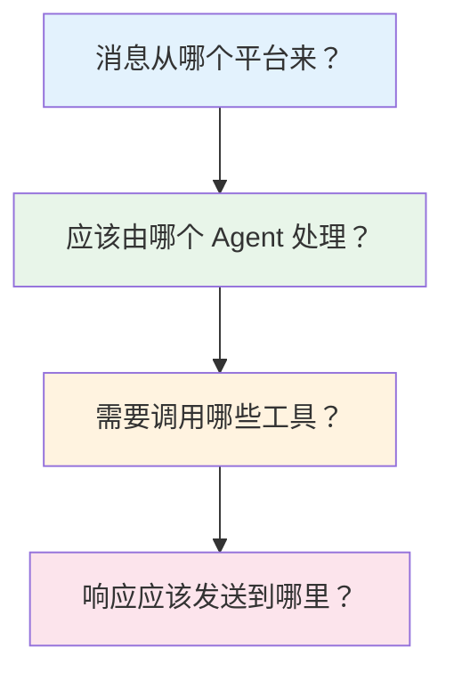
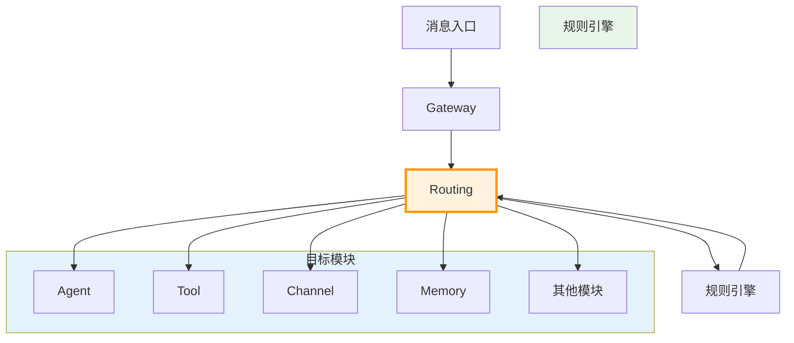

> **学习目标**：理解 Routing 如何将消息分发到正确的处理模块
> **前置知识**：第1-5章（项目概览到 Agent）
> **源码路径**：`src/routing/`
> **阅读时间**：40分钟

<SourceSnapshotCard
  repo="openclaw/openclaw"
  branch="main"
  commit="latest"
  verified-at="2024-03"
  :entries="[
    { label: 'Routing 入口', path: 'src/routing/' },
    { label: '路由规则', path: 'src/routing/rules.ts' }
  ]"
/>

## 6.1 概念引入

### 6.1.1 为什么需要 Routing？

OpenClaw 连接了 **20+ 消息平台**，每个平台可能有多个通道，每个通道可能有多个 Agent。当消息到达时：



**Routing 的职责**：回答这些问题，确保消息正确流转。

### 6.1.2 Routing 在架构中的位置



### 6.1.3 Routing 的核心职责

| 职责 | 说明 |
|------|------|
| **路由决策** | 决定消息应该发往哪里 |
| **规则匹配** | 根据规则引擎匹配目标 |
| **负载均衡** | 在多个目标间分配请求 |
| **优先级处理** | 处理紧急消息优先 |
| **失败重试** | 处理路由失败的情况 |

## 6.2 核心数据结构

### 6.2.1 路由规则

```typescript
// src/routing/rules.ts (概念示意)

interface RoutingRule {
  id: string;                    // 规则 ID
  name: string;                  // 规则名称
  priority: number;              // 优先级（数字越小越优先）
  enabled: boolean;              // 是否启用
  
  // 匹配条件
  conditions: Condition[];       // 匹配条件组
  
  // 目标
  target: RoutingTarget;         // 路由目标
  
  // 元数据
  createdAt: number;
  updatedAt: number;
}

interface Condition {
  field: string;                 // 字段名（如 'channelId', 'messageType'）
  operator: 'eq' | 'ne' | 'in' | 'contains' | 'regex';
  value: string | string[];      // 匹配值
}

type RoutingTarget = {
  type: 'agent' | 'tool' | 'channel' | 'memory';
  id: string;                    // 目标 ID
  params?: Record<string, unknown>; // 额外参数
};
```

### 6.2.2 路由上下文

```typescript
interface RoutingContext {
  message: GatewayMessage;       // 原始消息
  source: {
    channelId: string;           // 来源通道
    platform: string;            // 来源平台
    userId: string;              // 用户 ID
  };
  metadata: Record<string, unknown>; // 额外元数据
}
```

### 6.2.3 路由结果

```typescript
interface RoutingResult {
  matched: boolean;              // 是否匹配到规则
  rule?: RoutingRule;            // 匹配的规则
  target?: RoutingTarget;        // 目标
  alternatives?: RoutingTarget[]; // 备选目标
  error?: string;                // 错误信息
}
```

## 6.3 代码路径追踪

> **任务**：一条来自微信的消息"帮我写代码"，Routing 如何处理？

### 第一步：接收消息

```
Gateway 接收消息
        ↓
提取路由上下文
        ↓
构建 RoutingContext
        ↓
调用 Routing.route(context)
```

### 第二步：加载规则

```
从规则引擎加载规则
        ↓
按优先级排序
        ↓
过滤已禁用的规则
        ↓
得到候选规则列表
```

### 第三步：匹配规则

```
遍历候选规则
        ↓
评估每个条件
        ↓
第一个完全匹配的规则
        ↓
返回 RoutingResult
```

### 第四步：执行路由

```
根据 target.type 决定处理方式
        ↓
┌────────┼────────┐
│        │        │
agent   tool   channel
│        │        │
↓        ↓        ↓
Agent   Tool    直接转发
.process()
```

### 第五步：处理结果

```
目标返回处理结果
        ↓
Routing 封装响应
        ↓
返回给 Gateway
        ↓
推送给客户端
```

## 6.4 路由规则示例

### 6.4.1 按平台路由

```typescript
// 微信消息路由到特定 Agent
const wechatRule: RoutingRule = {
  id: 'rule-wechat-001',
  name: '微信消息路由',
  priority: 100,
  enabled: true,
  conditions: [
    { field: 'source.platform', operator: 'eq', value: 'wechat' }
  ],
  target: {
    type: 'agent',
    id: 'assistant-wechat',
    params: { model: 'gpt-4' }
  }
};
```

### 6.4.2 按消息类型路由

```typescript
// 命令消息路由到命令处理器
const commandRule: RoutingRule = {
  id: 'rule-command-001',
  name: '命令消息路由',
  priority: 10,  // 高优先级
  enabled: true,
  conditions: [
    { field: 'message.type', operator: 'eq', value: 'command' }
  ],
  target: {
    type: 'tool',
    id: 'command-handler'
  }
};
```

### 6.4.3 按关键词路由

```typescript
// 包含"代码"的消息路由到编程 Agent
const codeRule: RoutingRule = {
  id: 'rule-code-001',
  name: '编程相关消息路由',
  priority: 50,
  enabled: true,
  conditions: [
    { field: 'message.content', operator: 'contains', value: '代码' }
  ],
  target: {
    type: 'agent',
    id: 'code-assistant',
    params: { model: 'claude-3' }
  }
};
```

## 6.5 与其他模块的交互

### 6.5.1 Routing ↔ Gateway

```
Gateway                     Routing
   │                            │
   │  1. 接收消息               │
   │  2. 构建上下文             │
   │ ─────────────────────────►│
   │                            │
   │  3. 返回路由结果           │
   │ ◄───────────────────────── │
   │                            │
   │  4. 执行路由目标           │
```

### 6.5.2 Routing ↔ Agent

```
Routing                     Agent
   │                            │
   │  1. 匹配到 agent 目标      │
   │  2. 调用 Agent.process()   │
   │ ─────────────────────────►│
   │                            │
   │                            │  3. 处理消息
   │                            │
   │  4. 返回响应               │
   │ ◄───────────────────────── │
```

### 6.5.3 Routing ↔ Channel

```
Routing                     Channel
   │                            │
   │  1. 匹配到 channel 目标    │
   │  2. 转发消息               │
   │ ─────────────────────────►│
   │                            │
   │  3. 发送到外部平台         │
```

## 6.6 高级路由策略

### 6.6.1 负载均衡

```typescript
interface LoadBalancingStrategy {
  type: 'round-robin' | 'least-connections' | 'weighted';
  targets: RoutingTarget[];
  weights?: number[];
}

// 轮询示例
function roundRobin(targets: RoutingTarget[]): RoutingTarget {
  const index = (currentIndex++) % targets.length;
  return targets[index];
}
```

### 6.6.2 条件组合

```typescript
interface ConditionGroup {
  logic: 'and' | 'or';           // 逻辑关系
  conditions: (Condition | ConditionGroup)[]; // 嵌套条件
}

// 复杂条件示例
const complexRule: RoutingRule = {
  conditions: [
    {
      logic: 'and',
      conditions: [
        { field: 'source.platform', operator: 'eq', value: 'telegram' },
        {
          logic: 'or',
          conditions: [
            { field: 'message.type', operator: 'eq', value: 'chat' },
            { field: 'message.type', operator: 'eq', value: 'command' }
          ]
        }
      ]
    }
  ],
  // ...
};
```

## 6.7 常见修改场景

### 6.7.1 添加新的路由条件

1. 定义新的 Condition 字段
2. 实现匹配逻辑
3. 注册到规则引擎

### 6.7.2 实现自定义路由策略

1. 创建 RoutingStrategy 接口实现
2. 注册策略
3. 在规则中引用

### 6.7.3 添加路由监控

1. 记录路由决策日志
2. 统计规则命中率
3. 性能监控

## 6.8 概念→代码映射表

| 概念组件 | 对应目录/文件 | 核心作用 |
|---------|-------------|---------|
| **路由引擎** | `src/routing/engine.ts` | 规则匹配、目标选择 |
| **规则存储** | `src/routing/rules.ts` | 规则定义、持久化 |
| **条件评估** | `src/routing/conditions.ts` | 条件匹配逻辑 |
| **目标执行** | `src/routing/executor.ts` | 执行路由目标 |
| **负载均衡** | `src/routing/balancer.ts` | 目标分配策略 |

## 6.9 小结

Routing 是 OpenClaw 的**交通枢纽**，负责：
- 路由决策：根据规则决定消息去向
- 规则匹配：灵活的条件组合
- 负载均衡：合理分配请求

理解 Routing 后，你将更好地理解消息如何在不同模块间流转。

---

**下一章**：[第7章：通道系统](/06-channels/) - 了解 OpenClaw 如何连接 20+ 消息平台
