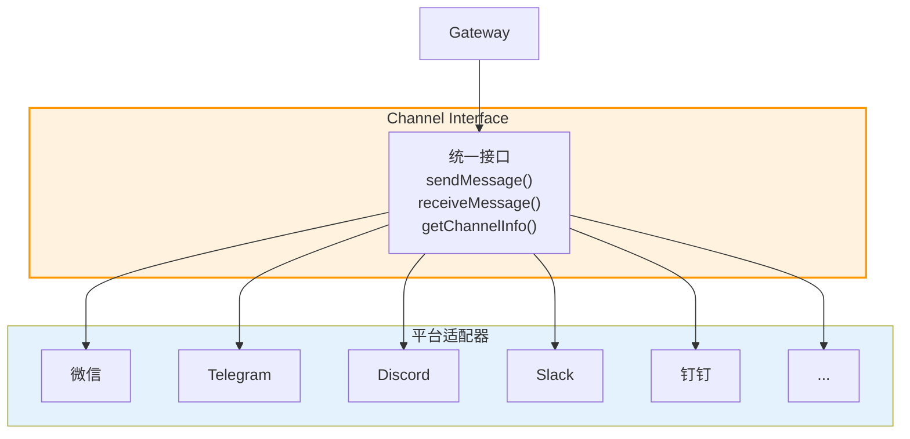

> **学习目标**：理解 Channel 如何抽象 20+ 消息平台，提供统一的接口
> **前置知识**：第1-6章（项目概览到 Routing）
> **源码路径**：`src/channels/`
> **阅读时间**：45分钟

<SourceSnapshotCard
  repo="openclaw/openclaw"
  branch="main"
  commit="latest"
  verified-at="2024-03"
  :entries="[
    { label: 'Channel 入口', path: 'src/channels/' },
    { label: '核心接口', path: 'src/channels/interface.ts' }
  ]"
/>

## 7.1 概念引入

### 7.1.1 为什么需要 Channel 抽象？

OpenClaw 支持 **20+ 消息平台**：
- 即时通讯：微信、Telegram、Discord、WhatsApp、Slack...
- 社交媒体：微博、Twitter/X、Facebook...
- 企业应用：钉钉、飞书、企业微信...

每个平台都有不同的：
- **连接方式**：WebSocket、HTTP Webhook、长轮询...
- **消息格式**：JSON、XML、私有协议...
- **API 差异**：认证、限流、功能支持...

**Channel 的职责**：屏蔽这些差异，提供统一的消息接口。

### 7.1.2 Channel 在架构中的位置



### 7.1.3 Channel 的核心职责

| 职责 | 说明 |
|------|------|
| **连接管理** | 建立和维护与平台的连接 |
| **消息接收** | 接收平台推送的消息 |
| **消息发送** | 向平台发送消息 |
| **格式转换** | 平台格式 ↔ 统一格式 |
| **事件处理** | 处理平台特有事件 |

## 7.2 核心接口设计

### 7.2.1 Channel 基础接口

```typescript
// src/channels/interface.ts (概念示意)

interface Channel {
  // 基础信息
  readonly id: string;           // 通道 ID
  readonly platform: string;     // 平台名称（wechat, telegram...）
  readonly name: string;         // 显示名称
  
  // 生命周期
  connect(): Promise<void>;      // 建立连接
  disconnect(): Promise<void>;   // 断开连接
  isConnected(): boolean;        // 连接状态
  
  // 消息操作
  send(message: OutgoingMessage): Promise<void>;
  onMessage(callback: MessageCallback): void;
  
  // 配置
  configure(config: ChannelConfig): Promise<void>;
}

interface ChannelConfig {
  // 认证信息
  credentials: Record<string, string>;
  
  // 行为配置
  options?: {
    polling?: boolean;           // 是否轮询
    webhook?: string;            // Webhook URL
    timeout?: number;            // 超时时间
  };
}
```

### 7.2.2 统一消息格式

```typescript
// 统一的消息格式 - 所有平台转换为这个格式
interface UnifiedMessage {
  id: string;                    // 消息 ID
  channelId: string;             // 通道 ID
  platform: string;              // 来源平台
  
  // 发送者信息
  sender: {
    id: string;                  // 用户 ID
    name?: string;               // 显示名称
    avatar?: string;             // 头像
    isBot?: boolean;             // 是否机器人
  };
  
  // 消息内容
  content: {
    type: 'text' | 'image' | 'video' | 'audio' | 'file' | 'location';
    text?: string;               // 文本内容
    media?: MediaContent;        // 媒体内容
  };
  
  // 元数据
  timestamp: number;             // 时间戳
  replyTo?: string;              // 回复的消息 ID
  metadata?: Record<string, unknown>; // 平台特有数据
}

interface OutgoingMessage {
  content: string | MediaContent;
  replyTo?: string;
  options?: SendMessageOptions;
}
```

### 7.2.3 事件类型

```typescript
type ChannelEvent =
  | { type: 'message'; data: UnifiedMessage }
  | { type: 'connected'; data: { channelId: string } }
  | { type: 'disconnected'; data: { channelId: string; reason?: string } }
  | { type: 'error'; data: { error: Error } }
  | { type: 'typing'; data: { userId: string } }
  | { type: 'read'; data: { userId: string; messageIds: string[] } };

type MessageCallback = (event: ChannelEvent) => void;
```

## 7.3 适配器模式实现

### 7.3.1 基类设计

```typescript
// src/channels/base.ts

abstract class BaseChannel implements Channel {
  readonly id: string;
  readonly platform: string;
  readonly name: string;
  
  protected callbacks: MessageCallback[] = [];
  protected connected = false;
  
  // 子类必须实现
  abstract connect(): Promise<void>;
  abstract disconnect(): Promise<void>;
  abstract send(message: OutgoingMessage): Promise<void>;
  
  // 平台特有方法
  abstract parseMessage(raw: unknown): UnifiedMessage;
  abstract formatMessage(msg: OutgoingMessage): PlatformMessage;
  
  // 通用方法
  onMessage(callback: MessageCallback): void {
    this.callbacks.push(callback);
  }
  
  protected emit(event: ChannelEvent): void {
    this.callbacks.forEach(cb => cb(event));
  }
  
  isConnected(): boolean {
    return this.connected;
  }
}
```

### 7.3.2 Telegram 适配器示例

```typescript
// src/channels/telegram.ts

class TelegramChannel extends BaseChannel {
  readonly platform = 'telegram';
  readonly name = 'Telegram';
  
  private bot: TelegramBot;
  
  constructor(config: TelegramConfig) {
    super();
    this.bot = new TelegramBot(config.token);
  }
  
  async connect(): Promise<void> {
    await this.bot.startPolling();
    this.connected = true;
    
    this.bot.on('message', (msg) => {
      const unified = this.parseMessage(msg);
      this.emit({ type: 'message', data: unified });
    });
  }
  
  async send(message: OutgoingMessage): Promise<void> {
    const formatted = this.formatMessage(message);
    await this.bot.sendMessage(formatted);
  }
  
  parseMessage(raw: TelegramMessage): UnifiedMessage {
    return {
      id: raw.message_id.toString(),
      channelId: this.id,
      platform: 'telegram',
      sender: {
        id: raw.from.id.toString(),
        name: raw.from.first_name,
        isBot: raw.from.is_bot
      },
      content: {
        type: 'text',
        text: raw.text
      },
      timestamp: raw.date * 1000
    };
  }
  
  formatMessage(msg: OutgoingMessage): TelegramOutgoing {
    return {
      chat_id: this.chatId,
      text: typeof msg.content === 'string' ? msg.content : undefined,
      // ...其他格式化
    };
  }
}
```

## 7.4 通道管理

### 7.4.1 Channel Registry

```typescript
// src/channels/registry.ts

class ChannelRegistry {
  private channels = new Map<string, Channel>();
  private factories = new Map<string, ChannelFactory>();
  
  // 注册通道工厂
  registerFactory(platform: string, factory: ChannelFactory): void {
    this.factories.set(platform, factory);
  }
  
  // 创建通道实例
  async createChannel(config: ChannelConfig): Promise<Channel> {
    const factory = this.factories.get(config.platform);
    if (!factory) {
      throw new Error(`Unknown platform: ${config.platform}`);
    }
    
    const channel = await factory.create(config);
    this.channels.set(channel.id, channel);
    return channel;
  }
  
  // 获取通道
  getChannel(id: string): Channel | undefined {
    return this.channels.get(id);
  }
  
  // 获取所有通道
  getAllChannels(): Channel[] {
    return Array.from(this.channels.values());
  }
}
```

### 7.4.2 通道生命周期

```
┌─────────────────────────────────────────┐
│         通道生命周期                     │
├─────────────────────────────────────────┤
│                                         │
│   配置加载 ──► 创建实例 ──► 连接平台     │
│                   │                     │
│                   ▼                     │
│              运行中                       │
│                   │                     │
│        ┌──────────┼──────────┐          │
│        │          │          │          │
│     重连      错误处理    配置更新        │
│        │          │          │          │
│        └──────────┼──────────┘          │
│                   │                     │
│                   ▼                     │
│              断开连接                    │
│                   │                     │
│                   ▼                     │
│              销毁实例                    │
│                                         │
└─────────────────────────────────────────┘
```

## 7.5 与其他模块的交互

### 7.5.1 Channel ↔ Gateway

```
Channel                     Gateway
   │                            │
   │  1. 收到外部消息           │
   │  2. 转换为统一格式         │
   │  3. 推送给 Gateway         │
   │ ─────────────────────────►│
   │                            │
   │  4. Gateway 返回响应       │
   │ ◄───────────────────────── │
   │                            │
   │  5. 发送到外部平台         │
```

### 7.5.2 Channel ↔ Routing

```
Routing                     Channel
   │                            │
   │  1. 路由到通道目标         │
   │  2. 调用 channel.send()    │
   │ ─────────────────────────►│
   │                            │
   │  3. Channel 发送消息       │
   │                            │
   │  4. 返回发送结果           │
   │ ◄───────────────────────── │
```

## 7.6 平台特性处理

### 7.6.1 微信特殊处理

```typescript
class WeChatChannel extends BaseChannel {
  // 微信需要处理：
  // 1. 长连接保活
  // 2. 消息加密/解密
  // 3. 媒体文件上传
  // 4. 企业微信 vs 个人微信 差异
  
  protected async keepAlive(): Promise<void> {
    setInterval(() => {
      this.sendHeartbeat();
    }, 30000);
  }
  
  protected decryptMessage(encrypted: string): string {
    // AES 解密
  }
}
```

### 7.6.2 Discord 特殊处理

```typescript
class DiscordChannel extends BaseChannel {
  // Discord 需要：
  // 1. WebSocket 连接
  // 2. 心跳保活
  // 3. Embed 消息格式
  // 4. Slash 命令
  
  protected async handleInteraction(interaction: DiscordInteraction) {
    if (interaction.type === 'APPLICATION_COMMAND') {
      // 处理 Slash 命令
    }
  }
}
```

## 7.7 概念→代码映射表

| 概念组件 | 对应目录/文件 | 核心作用 |
|---------|-------------|---------|
| **核心接口** | `src/channels/interface.ts` | 统一的消息接口定义 |
| **基类实现** | `src/channels/base.ts` | 通用逻辑封装 |
| **通道注册** | `src/channels/registry.ts` | 管理通道实例 |
| **消息转换** | `src/channels/transformer.ts` | 格式转换工具 |
| **平台适配器** | `src/channels/adapters/` | 各平台具体实现 |

## 7.8 小结

Channel 是 OpenClaw 的**统一接口层**，负责：
- 抽象差异：屏蔽不同平台的 API 差异
- 格式统一：所有消息转换为统一格式
- 生命周期管理：连接、断开、重连

下一章将介绍内置的通道实现，展示如何在实践中应用这些抽象。

---

**下一章**：[第8章：内置通道](/07-builtins/) - 了解 OpenClaw 内置支持的消息平台
