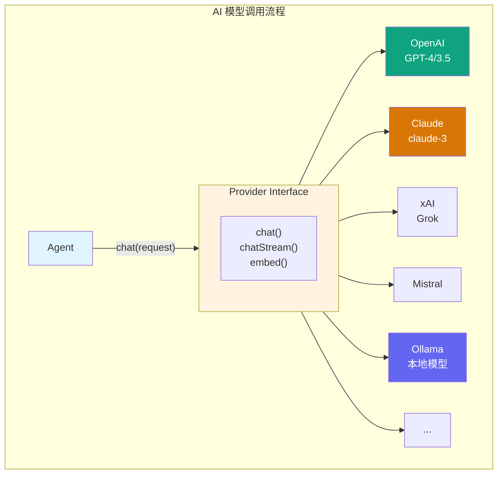

> **学习目标**：理解 Provider 如何抽象多种 AI 模型，提供统一的调用接口
> **前置知识**：第1-9章（项目概览到扩展开发）
> **源码路径**：`src/providers/`
> **阅读时间**：55分钟

<SourceSnapshotCard
  repo="openclaw/openclaw"
  branch="main"
  commit="latest"
  verified-at="2024-03"
  :entries="[
    { label: 'Provider 入口', path: 'src/providers/' },
    { label: '核心接口', path: 'src/providers/interface.ts' }
  ]"
/>

## 10.1 概念引入

### 10.1.1 为什么需要 Provider 抽象？

OpenClaw 需要支持 **多种 AI 模型**：
- OpenAI (GPT-4, GPT-3.5)
- Anthropic (Claude 3)
- xAI (Grok)
- Mistral
- 本地模型 (Ollama, LM Studio)

每个模型都有不同的：
- **API 格式**：请求/响应结构
- **认证方式**：API Key、OAuth
- **功能差异**：流式响应、函数调用、视觉能力

**Provider 的职责**：统一这些差异，让 Agent 可以无缝切换模型。

### 10.1.2 Provider 在架构中的位置



### 10.1.3 Provider 的核心职责

| 职责 | 说明 |
|------|------|
| **模型选择** | 根据任务选择合适的模型 |
| **认证管理** | 处理 API Key、OAuth 等认证 |
| **请求构建** | 构建符合模型 API 的请求 |
| **响应解析** | 解析模型响应为统一格式 |
| **流式处理** | 支持 SSE 流式输出 |
| **错误处理** | 处理限流、超时等错误 |

## 10.2 核心接口设计

### 10.2.1 Provider 基础接口

```typescript
// src/providers/interface.ts (概念示意)

interface Provider {
  // 基础信息
  readonly id: string;              // 提供者 ID
  readonly name: string;            // 显示名称
  readonly models: string[];        // 支持的模型列表
  
  // 认证
  readonly authMethod: AuthMethod;
  authenticate(credentials: Credentials): Promise<void>;
  
  // 聊天完成
  chat(request: ChatRequest): Promise<ChatResponse>;
  chatStream(request: ChatRequest): AsyncIterable<ChatChunk>;
  
  // 嵌入（可选）
  embed?(request: EmbedRequest): Promise<EmbedResponse>;
  
  // 模型信息
  getModelInfo(model: string): ModelInfo;
}
```

### 10.2.2 认证方法

```typescript
interface AuthMethod {
  type: 'api_key' | 'oauth' | 'custom';
  fields: AuthField[];
}

interface AuthField {
  name: string;
  label: string;
  type: 'text' | 'password' | 'url';
  required: boolean;
  placeholder?: string;
}

// 示例：OpenAI 的认证方法
const openaiAuth: AuthMethod = {
  type: 'api_key',
  fields: [
    { name: 'apiKey', label: 'API Key', type: 'password', required: true }
  ]
};

// 示例：自定义端点的认证方法
const ollamaAuth: AuthMethod = {
  type: 'custom',
  fields: [
    { name: 'baseUrl', label: 'Ollama URL', type: 'url', required: true, placeholder: 'http://localhost:11434' }
  ]
};
```

### 10.2.3 统一请求/响应格式

```typescript
// 统一的聊天请求
interface ChatRequest {
  model: string;                    // 模型 ID
  messages: Message[];              // 消息历史
  temperature?: number;             // 温度参数
  maxTokens?: number;               // 最大 Token 数
  topP?: number;                    // Top P 采样
  stop?: string[];                  // 停止序列
  tools?: Tool[];                   // 可用工具
  toolChoice?: 'auto' | 'none' | { type: 'function'; name: string };
}

// 统一的聊天响应
interface ChatResponse {
  id: string;                       // 响应 ID
  model: string;                    // 使用的模型
  choices: Choice[];                // 响应选项
  usage: Usage;                     // Token 使用统计
}

interface Choice {
  index: number;
  message: Message;
  finishReason: 'stop' | 'length' | 'tool_calls' | 'content_filter';
}

interface Message {
  role: 'system' | 'user' | 'assistant' | 'tool';
  content: string;
  name?: string;
  toolCalls?: ToolCall[];
  toolCallId?: string;
}

interface Usage {
  promptTokens: number;
  completionTokens: number;
  totalTokens: number;
}
```

## 10.3 内置 Provider 实现

### 10.3.1 OpenAI Provider

```typescript
// src/providers/openai.ts

class OpenAIProvider implements Provider {
  readonly id = 'openai';
  readonly name = 'OpenAI';
  readonly models = ['gpt-4', 'gpt-4-turbo', 'gpt-3.5-turbo'];
  
  private client: OpenAI;
  
  readonly authMethod = {
    type: 'api_key' as const,
    fields: [
      { name: 'apiKey', label: 'API Key', type: 'password', required: true }
    ]
  };
  
  async authenticate(credentials: { apiKey: string }): Promise<void> {
    this.client = new OpenAI({ apiKey: credentials.apiKey });
  }
  
  async chat(request: ChatRequest): Promise<ChatResponse> {
    const response = await this.client.chat.completions.create({
      model: request.model,
      messages: this.convertMessages(request.messages),
      temperature: request.temperature,
      max_tokens: request.maxTokens,
      tools: this.convertTools(request.tools)
    });
    
    return this.convertResponse(response);
  }
  
  async *chatStream(request: ChatRequest): AsyncIterable<ChatChunk> {
    const stream = await this.client.chat.completions.create({
      model: request.model,
      messages: this.convertMessages(request.messages),
      stream: true
    });
    
    for await (const chunk of stream) {
      yield this.convertChunk(chunk);
    }
  }
  
  // 格式转换方法
  private convertMessages(messages: Message[]): OpenAIMessage[] {
    return messages.map(msg => ({
      role: msg.role,
      content: msg.content,
      name: msg.name,
      tool_calls: msg.toolCalls
    }));
  }
  
  private convertResponse(response: OpenAIResponse): ChatResponse {
    return {
      id: response.id,
      model: response.model,
      choices: response.choices.map(choice => ({
        index: choice.index,
        message: {
          role: choice.message.role,
          content: choice.message.content,
          toolCalls: choice.message.tool_calls
        },
        finishReason: choice.finish_reason
      })),
      usage: {
        promptTokens: response.usage.prompt_tokens,
        completionTokens: response.usage.completion_tokens,
        totalTokens: response.usage.total_tokens
      }
    };
  }
}
```

### 10.3.2 Anthropic Provider

```typescript
// src/providers/anthropic.ts

class AnthropicProvider implements Provider {
  readonly id = 'anthropic';
  readonly name = 'Anthropic';
  readonly models = ['claude-3-opus', 'claude-3-sonnet', 'claude-3-haiku'];
  
  private client: Anthropic;
  
  async chat(request: ChatRequest): Promise<ChatResponse> {
    const response = await this.client.messages.create({
      model: request.model,
      messages: this.convertMessages(request.messages),
      system: this.extractSystemPrompt(request.messages),
      max_tokens: request.maxTokens || 4096
    });
    
    return this.convertResponse(response);
  }
  
  // Claude 特有：System Prompt 单独传递
  private extractSystemPrompt(messages: Message[]): string | undefined {
    const systemMsg = messages.find(m => m.role === 'system');
    return systemMsg?.content;
  }
  
  private convertMessages(messages: Message[]): AnthropicMessage[] {
    return messages
      .filter(m => m.role !== 'system')
      .map(msg => ({
        role: msg.role === 'assistant' ? 'assistant' : 'user',
        content: msg.content
      }));
  }
}
```

### 10.3.3 Ollama Provider（本地模型）

```typescript
// src/providers/ollama.ts

class OllamaProvider implements Provider {
  readonly id = 'ollama';
  readonly name = 'Ollama';
  readonly models: string[] = [];  // 动态获取
  
  private baseUrl: string;
  
  readonly authMethod = {
    type: 'custom' as const,
    fields: [
      { name: 'baseUrl', label: 'Ollama URL', type: 'url', required: true, placeholder: 'http://localhost:11434' }
    ]
  };
  
  async authenticate(credentials: { baseUrl: string }): Promise<void> {
    this.baseUrl = credentials.baseUrl;
    await this.fetchModels();
  }
  
  private async fetchModels(): Promise<void> {
    const response = await fetch(`${this.baseUrl}/api/tags`);
    const data = await response.json();
    this.models = data.models.map((m: any) => m.name);
  }
  
  async chat(request: ChatRequest): Promise<ChatResponse> {
    const response = await fetch(`${this.baseUrl}/api/chat`, {
      method: 'POST',
      headers: { 'Content-Type': 'application/json' },
      body: JSON.stringify({
        model: request.model,
        messages: request.messages,
        stream: false
      })
    });
    
    const data = await response.json();
    return this.convertResponse(data);
  }
  
  async *chatStream(request: ChatRequest): AsyncIterable<ChatChunk> {
    const response = await fetch(`${this.baseUrl}/api/chat`, {
      method: 'POST',
      headers: { 'Content-Type': 'application/json' },
      body: JSON.stringify({
        model: request.model,
        messages: request.messages,
        stream: true
      })
    });
    
    const reader = response.body!.getReader();
    const decoder = new TextDecoder();
    
    while (true) {
      const { done, value } = await reader.read();
      if (done) break;
      
      const line = decoder.decode(value);
      const chunk = JSON.parse(line);
      yield this.convertChunk(chunk);
    }
  }
}
```

## 10.4 Provider 注册与管理

### 10.4.1 Provider Registry

```typescript
// src/providers/registry.ts

class ProviderRegistry {
  private providers = new Map<string, Provider>();
  private factories = new Map<string, ProviderFactory>();
  
  // 注册 Provider 工厂
  registerFactory(id: string, factory: ProviderFactory): void {
    this.factories.set(id, factory);
  }
  
  // 创建 Provider 实例
  async createProvider(id: string, config: ProviderConfig): Promise<Provider> {
    const factory = this.factories.get(id);
    if (!factory) {
      throw new Error(`Unknown provider: ${id}`);
    }
    
    const provider = await factory.create(config);
    await provider.authenticate(config.credentials);
    this.providers.set(provider.id, provider);
    return provider;
  }
  
  // 获取 Provider
  getProvider(id: string): Provider | undefined {
    return this.providers.get(id);
  }
  
  // 获取所有可用 Provider
  getAvailableProviders(): ProviderInfo[] {
    return Array.from(this.factories.entries()).map(([id, factory]) => ({
      id,
      name: factory.name,
      models: factory.models,
      authMethod: factory.authMethod
    }));
  }
}
```

### 10.4.2 模型选择策略

```typescript
// src/providers/selector.ts

interface ModelSelector {
  selectModel(request: ChatRequest, providers: Provider[]): ModelSelection;
}

class DefaultModelSelector implements ModelSelector {
  selectModel(request: ChatRequest, providers: Provider[]): ModelSelection {
    // 1. 如果指定了模型，直接使用
    if (request.model) {
      const provider = this.findProviderForModel(request.model, providers);
      if (provider) {
        return { provider, model: request.model };
      }
    }
    
    // 2. 根据任务类型选择最佳模型
    const taskType = this.detectTaskType(request.messages);
    const bestModel = this.getBestModelForTask(taskType, providers);
    
    return bestModel;
  }
  
  private detectTaskType(messages: Message[]): TaskType {
    // 检测任务类型：代码、推理、创意等
    const lastMessage = messages[messages.length - 1];
    const content = lastMessage.content.toLowerCase();
    
    if (content.includes('代码') || content.includes('code')) {
      return 'code';
    }
    if (content.includes('分析') || content.includes('analyze')) {
      return 'reasoning';
    }
    return 'general';
  }
}
```

## 10.5 与 Agent 的集成

### 10.5.1 Agent 调用 Provider

```typescript
// Agent 中的 Provider 调用
class Agent {
  private provider: Provider;
  
  async process(message: Message): Promise<Message> {
    // 1. 构建请求
    const request: ChatRequest = {
      model: this.config.model,
      messages: this.session.messages,
      temperature: this.config.temperature,
      maxTokens: this.config.maxTokens,
      tools: this.getAvailableTools()
    };
    
    // 2. 调用 Provider
    if (this.config.stream) {
      return await this.processStream(request);
    } else {
      const response = await this.provider.chat(request);
      return response.choices[0].message;
    }
  }
  
  private async processStream(request: ChatRequest): Promise<Message> {
    let fullContent = '';
    
    for await (const chunk of this.provider.chatStream(request)) {
      const content = chunk.choices[0]?.delta?.content || '';
      fullContent += content;
      
      // 回调流式输出
      this.onStreamChunk?.(content);
    }
    
    return { role: 'assistant', content: fullContent };
  }
}
```

## 10.6 概念→代码映射表

| 概念组件 | 对应目录/文件 | 核心作用 |
|---------|-------------|---------|
| **Provider 接口** | `src/providers/interface.ts` | 统一的模型调用接口 |
| **OpenAI 实现** | `src/providers/openai.ts` | OpenAI GPT 系列模型 |
| **Anthropic 实现** | `src/providers/anthropic.ts` | Claude 系列模型 |
| **Ollama 实现** | `src/providers/ollama.ts` | 本地模型支持 |
| **Provider 注册** | `src/providers/registry.ts` | 管理提供者实例 |
| **模型选择器** | `src/providers/selector.ts` | 自动选择最佳模型 |

## 10.7 小结

Provider 是 OpenClaw 的**AI 模型抽象层**，负责：
- 统一接口：屏蔽不同模型的 API 差异
- 模型管理：注册、选择、切换模型
- 认证管理：处理各种认证方式

理解 Provider 后，你可以轻松添加新的 AI 模型支持。

---

**下一章**：[第11章：Plugin SDK](/10-plugin-sdk/) - 深入了解插件开发 SDK
