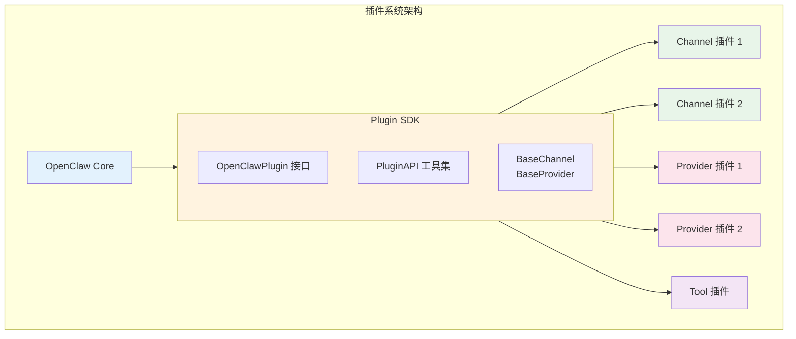
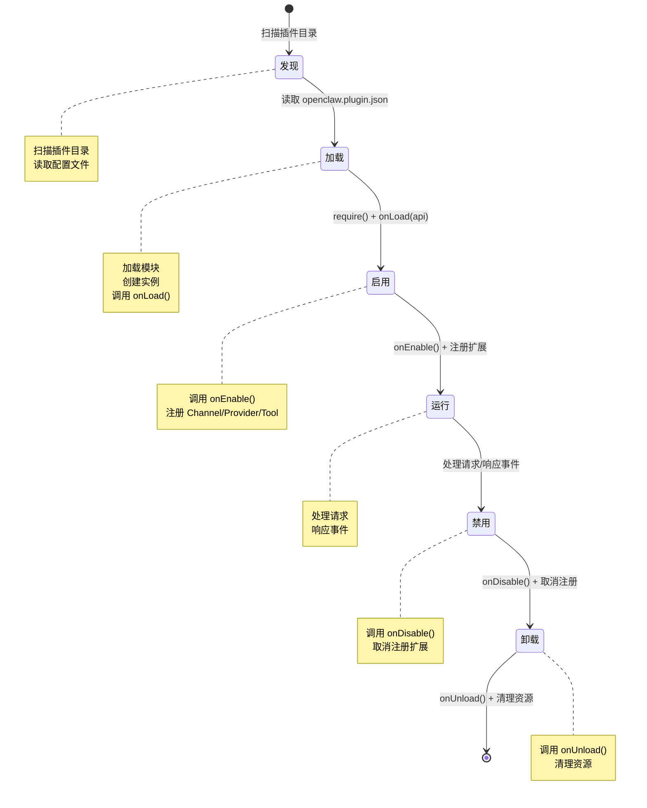

> **学习目标**：掌握 Plugin SDK 的核心概念和开发模式
> **前置知识**：第1-10章（项目概览到 Provider）
> **源码路径**：`src/plugin-sdk/`
> **阅读时间**：50分钟

<SourceSnapshotCard
  repo="openclaw/openclaw"
  branch="main"
  commit="latest"
  verified-at="2024-03"
  :entries="[
    { label: 'Plugin SDK 入口', path: 'src/plugin-sdk/' },
    { label: '核心类型', path: 'src/plugin-sdk/types.ts' }
  ]"
/>

## 11.1 概念引入

### 11.1.1 为什么需要 Plugin SDK？

OpenClaw 采用**插件化架构**，核心功能通过插件扩展：
- **Channel 插件**：添加新的消息平台支持
- **Provider 插件**：集成新的 AI 模型
- **Tool 插件**：添加新的工具能力

**Plugin SDK 的职责**：提供标准化的插件开发接口和工具。

### 11.1.2 Plugin SDK 在架构中的位置



## 11.2 核心接口设计

### 11.2.1 OpenClawPlugin 接口

```typescript
// src/plugin-sdk/types.ts

interface OpenClawPlugin {
  // 插件元数据
  name: string;                    // 插件名称（唯一标识）
  version: string;                 // 版本号（semver）
  description: string;             // 描述
  
  // 作者信息
  author?: string;
  license?: string;
  homepage?: string;
  
  // 依赖声明
  dependencies?: {
    openclaw?: string;             // OpenClaw 版本要求
    plugins?: string[];            // 其他插件依赖
  };
  
  // 生命周期钩子
  onLoad?(api: PluginAPI): Promise<void>;
  onUnload?(): Promise<void>;
  onEnable?(): Promise<void>;
  onDisable?(): Promise<void>;
  
  // 扩展注册
  registerChannel?: (factory: ChannelFactory) => void;
  registerProvider?: (factory: ProviderFactory) => void;
  registerTool?: (tool: Tool) => void;
}
```

### 11.2.2 PluginAPI 接口

```typescript
// 插件可用的 API
interface PluginAPI {
  // ===== 日志系统 =====
  logger: {
    debug(message: string, ...args: unknown[]): void;
    info(message: string, ...args: unknown[]): void;
    warn(message: string, ...args: unknown[]): void;
    error(message: string, ...args: unknown[]): void;
  };
  
  // ===== 配置管理 =====
  config: {
    get<T>(key: string, defaultValue?: T): T;
    set(key: string, value: unknown): void;
    has(key: string): boolean;
    delete(key: string): void;
  };
  
  // ===== 持久化存储 =====
  storage: {
    get<T>(key: string): Promise<T | undefined>;
    set(key: string, value: unknown): Promise<void>;
    delete(key: string): Promise<void>;
    clear(): Promise<void>;
  };
  
  // ===== 扩展注册 =====
  registerChannel(factory: ChannelFactory): void;
  registerProvider(factory: ProviderFactory): void;
  registerTool(tool: Tool): void;
  
  // ===== 事件系统 =====
  events: {
    on(event: string, handler: EventHandler): void;
    off(event: string, handler: EventHandler): void;
    emit(event: string, data: unknown): void;
  };
  
  // ===== HTTP 客户端 =====
  http: {
    fetch(url: string, options?: RequestInit): Promise<Response>;
    get<T>(url: string): Promise<T>;
    post<T>(url: string, body: unknown): Promise<T>;
  };
  
  // ===== 缓存系统 =====
  cache: {
    get<T>(key: string): Promise<T | undefined>;
    set(key: string, value: unknown, ttl?: number): Promise<void>;
    delete(key: string): Promise<void>;
  };
}
```

### 11.2.3 基类设计

```typescript
// src/plugin-sdk/base.ts

// Channel 基类
abstract class BaseChannel implements Channel {
  readonly id: string;
  readonly platform: string;
  readonly name: string;
  
  protected api: PluginAPI;
  protected callbacks: MessageCallback[] = [];
  protected connected = false;
  
  constructor(api: PluginAPI, config: ChannelConfig) {
    this.api = api;
    this.id = config.id;
    // ...
  }
  
  // 子类必须实现
  abstract connect(): Promise<void>;
  abstract disconnect(): Promise<void>;
  abstract send(message: OutgoingMessage): Promise<void>;
  
  // 平台特有方法
  abstract parseMessage(raw: unknown): UnifiedMessage;
  abstract formatMessage(msg: OutgoingMessage): PlatformMessage;
  
  // 通用方法
  onMessage(callback: MessageCallback): void {
    this.callbacks.push(callback);
  }
  
  protected emit(event: ChannelEvent): void {
    this.callbacks.forEach(cb => cb(event));
  }
  
  isConnected(): boolean {
    return this.connected;
  }
}

// Provider 基类
abstract class BaseProvider implements Provider {
  readonly id: string;
  readonly name: string;
  readonly models: string[];
  
  protected api: PluginAPI;
  
  constructor(api: PluginAPI, config: ProviderConfig) {
    this.api = api;
    this.id = config.id;
    // ...
  }
  
  // 子类必须实现
  abstract authenticate(credentials: Credentials): Promise<void>;
  abstract chat(request: ChatRequest): Promise<ChatResponse>;
  abstract chatStream(request: ChatRequest): AsyncIterable<ChatChunk>;
  
  // 可选实现
  embed?(request: EmbedRequest): Promise<EmbedResponse>;
}
```

## 11.3 插件生命周期

### 11.3.1 生命周期阶段



### 11.3.2 生命周期钩子

```typescript
// 插件实现示例
const myPlugin: OpenClawPlugin = {
  name: 'my-plugin',
  version: '1.0.0',
  description: 'My custom plugin',
  
  // 加载时调用 - 初始化资源
  async onLoad(api) {
    api.logger.info('Plugin loading...');
    
    // 读取配置
    const config = api.config.get('myPlugin', {});
    
    // 初始化存储
    await api.storage.set('initialized', true);
  },
  
  // 启用时调用 - 开始工作
  async onEnable() {
    console.log('Plugin enabled');
    
    // 注册扩展
    // this.registerChannel?.(myChannelFactory);
  },
  
  // 禁用时调用 - 暂停工作
  async onDisable() {
    console.log('Plugin disabled');
  },
  
  // 卸载时调用 - 清理资源
  async onUnload() {
    console.log('Plugin unloaded');
    
    // 清理定时器、连接等
  }
};
```

## 11.4 工厂模式

### 11.4.1 ChannelFactory

```typescript
interface ChannelFactory {
  platform: string;              // 平台标识
  name: string;                  // 显示名称
  description?: string;          // 描述
  
  // 配置模式
  configSchema: JSONSchema;      // 配置的 JSON Schema
  
  // 创建实例
  create(config: ChannelConfig): Promise<Channel>;
  
  // 验证配置
  validateConfig(config: unknown): boolean;
}

// 注册 Channel
api.registerChannel({
  platform: 'custom',
  name: 'Custom Platform',
  configSchema: {
    type: 'object',
    properties: {
      apiKey: { type: 'string' },
      webhookUrl: { type: 'string', format: 'uri' }
    },
    required: ['apiKey']
  },
  
  async create(config) {
    const channel = new CustomChannel(api, config);
    return channel;
  },
  
  validateConfig(config) {
    // 验证配置
    return config.apiKey && typeof config.apiKey === 'string';
  }
});
```

### 11.4.2 ProviderFactory

```typescript
interface ProviderFactory {
  id: string;                    // 提供者 ID
  name: string;                  // 显示名称
  models: string[];              // 支持的模型列表
  authMethod: AuthMethod;        // 认证方法
  
  create(config: ProviderConfig): Promise<Provider>;
}

// 注册 Provider
api.registerProvider({
  id: 'custom-provider',
  name: 'Custom AI Provider',
  models: ['custom-1', 'custom-2'],
  authMethod: {
    type: 'api_key',
    fields: [
      { name: 'apiKey', label: 'API Key', type: 'password', required: true }
    ]
  },
  
  async create(config) {
    const provider = new CustomProvider(api, config);
    await provider.authenticate(config.credentials);
    return provider;
  }
});
```

## 11.5 事件系统

### 11.5.1 内置事件

```typescript
// 系统事件
type SystemEvent =
  | 'plugin:loaded'      // 插件加载完成
  | 'plugin:enabled'     // 插件启用
  | 'plugin:disabled'    // 插件禁用
  | 'plugin:unloaded'    // 插件卸载
  | 'channel:connected'  // 通道连接
  | 'channel:disconnected' // 通道断开
  | 'provider:ready'     // 提供者就绪
  | 'provider:error';    // 提供者错误

// 监听事件
api.events.on('channel:connected', (data) => {
  api.logger.info('Channel connected:', data.channelId);
});

// 发送自定义事件
api.events.emit('my-plugin:custom-event', { data: 'value' });
```

### 11.5.2 事件最佳实践

```typescript
// 插件内的事件处理
async onLoad(api: PluginAPI) {
  // 监听系统事件
  api.events.on('channel:connected', this.handleChannelConnected.bind(this));
  api.events.on('provider:error', this.handleProviderError.bind(this));
}

async onUnload() {
  // 清理事件监听器
  api.events.off('channel:connected', this.handleChannelConnected);
  api.events.off('provider:error', this.handleProviderError);
}

private handleChannelConnected(data: { channelId: string }) {
  this.api.logger.info(`Channel ${data.channelId} connected`);
}
```

## 11.6 配置管理

### 11.6.1 配置模式

```typescript
// openclaw.yaml
plugins:
  my-plugin:
    enabled: true
    config:
      apiKey: ${MY_PLUGIN_API_KEY}
      timeout: 30000
      features:
        - feature1
        - feature2
```

### 11.6.2 读取配置

```typescript
async onLoad(api: PluginAPI) {
  // 获取插件配置
  const apiKey = api.config.get('apiKey');
  const timeout = api.config.get('timeout', 30000);  // 默认值
  const features = api.config.get('features', []);
  
  // 支持环境变量
  // apiKey: ${MY_PLUGIN_API_KEY} → 自动替换
}
```

## 11.7 开发工具

### 11.7.1 类型定义

```typescript
// @openclaw/plugin-sdk 导出
export {
  // 核心接口
  OpenClawPlugin,
  PluginAPI,
  
  // Channel 相关
  Channel,
  ChannelFactory,
  ChannelConfig,
  ChannelEvent,
  BaseChannel,
  UnifiedMessage,
  OutgoingMessage,
  
  // Provider 相关
  Provider,
  ProviderFactory,
  ProviderConfig,
  AuthMethod,
  BaseProvider,
  ChatRequest,
  ChatResponse,
  
  // Tool 相关
  Tool,
  ToolResult,
  
  // 工具类型
  JSONSchema,
  EventHandler,
  Logger
};
```

### 11.7.2 CLI 工具

```bash
# 创建新插件
openclaw plugin create my-plugin --type channel

# 验证插件
openclaw plugin validate ./my-plugin

# 打包插件
openclaw plugin pack ./my-plugin

# 发布插件
openclaw plugin publish ./my-plugin.tgz
```

## 11.8 概念→代码映射表

| 概念组件 | 对应目录/文件 | 核心作用 |
|---------|-------------|---------|
| **Plugin 接口** | `src/plugin-sdk/types.ts` | 插件定义标准 |
| **PluginAPI** | `src/plugin-sdk/api.ts` | 插件可用 API |
| **BaseChannel** | `src/plugin-sdk/base/channel.ts` | Channel 基类 |
| **BaseProvider** | `src/plugin-sdk/base/provider.ts` | Provider 基类 |
| **事件系统** | `src/plugin-sdk/events.ts` | 插件事件管理 |
| **配置管理** | `src/plugin-sdk/config.ts` | 插件配置 |

## 11.9 小结

Plugin SDK 是 OpenClaw 的**插件开发基础**，提供：
- 标准接口：统一的插件定义
- 生命周期：完整的加载/卸载流程
- 工具 API：日志、配置、存储、事件

理解 Plugin SDK 后，你可以开发自己的扩展插件。

---

**下一章**：[第12章：工具系统](/11-tools/) - 了解 OpenClaw 的工具扩展机制
