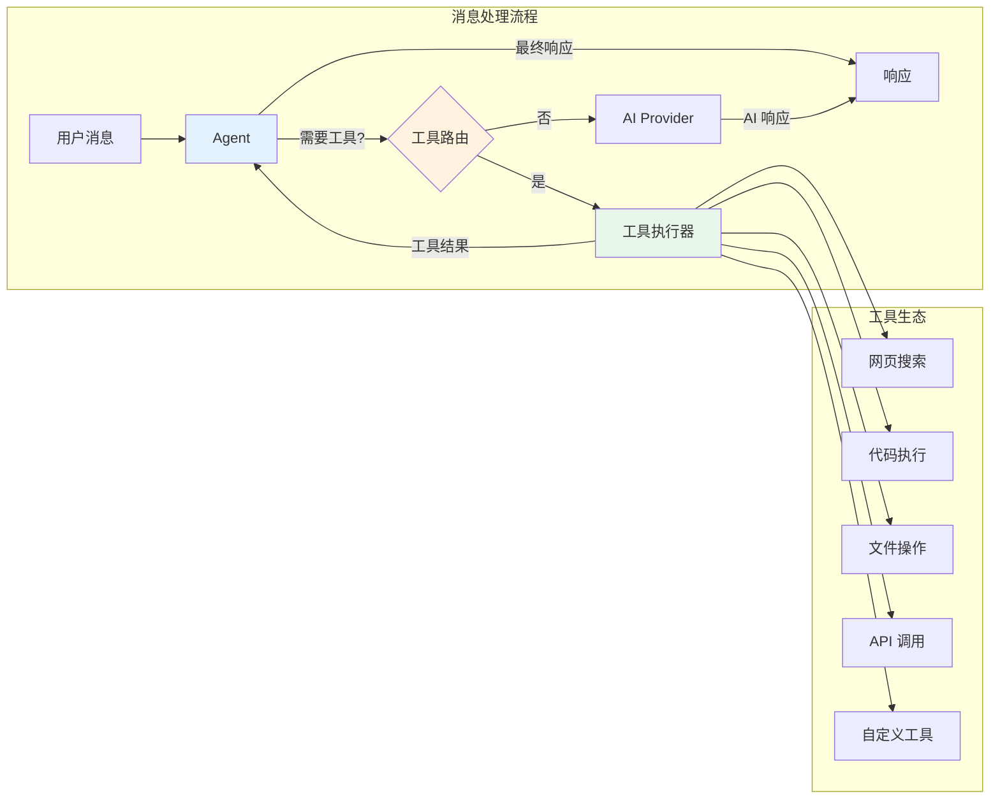
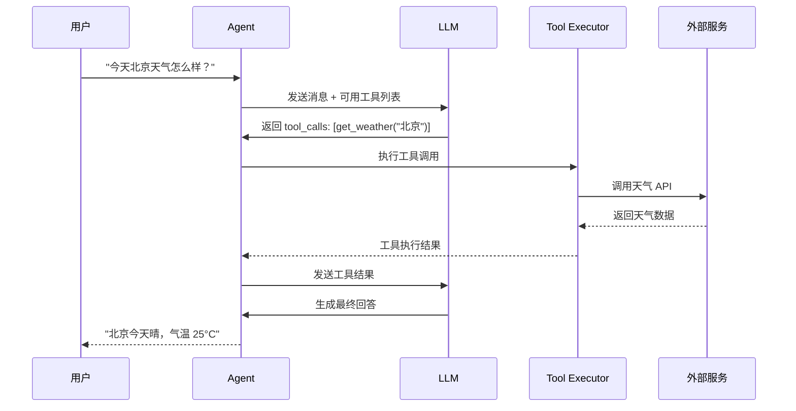
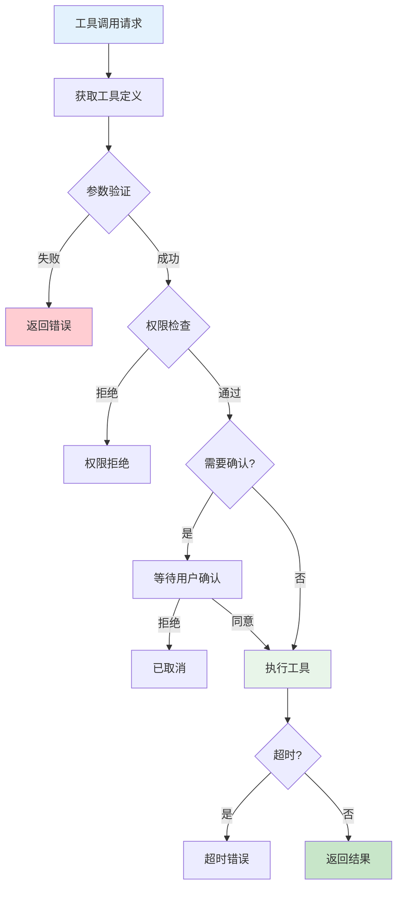
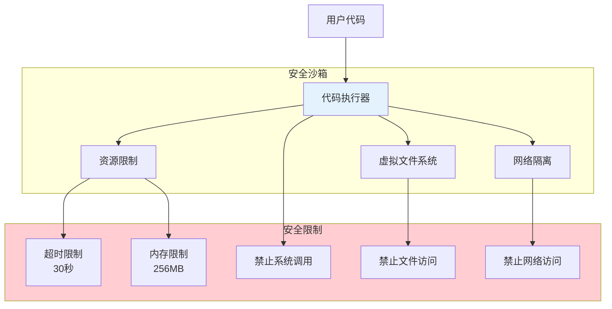

> **学习目标**：理解 OpenClaw 如何实现 AI 调用外部工具的能力
> **前置知识**：第1-11章（项目概览到 Plugin SDK）
> **源码路径**：`src/tools/`
> **阅读时间**：45分钟

<SourceSnapshotCard
  repo="openclaw/openclaw"
  branch="main"
  commit="latest"
  verified-at="2024-03"
  :entries="[
    { label: 'Tools 入口', path: 'src/tools/' },
    { label: '核心类型', path: 'src/tools/types.ts' }
  ]"
/>

## 12.1 概念引入

### 12.1.1 为什么需要工具系统？

大语言模型（LLM）本身**无法直接操作外部世界**：
- 无法访问实时数据（天气、股票、新闻）
- 无法执行代码
- 无法访问本地文件
- 无法调用 API

**工具系统**让 AI 能够：
- 获取实时信息
- 执行计算任务
- 操作外部系统
- 与用户环境交互

### 12.1.2 工具系统在架构中的位置



### 12.1.3 工具调用流程



## 12.2 工具定义

### 12.2.1 Tool 接口

```typescript
// src/tools/types.ts

interface Tool {
  // 工具标识
  name: string;                    // 工具名称（唯一）
  description: string;             // 工具描述（LLM 会看到）
  
  // 参数模式
  parameters: JSONSchema;          // 参数的 JSON Schema
  
  // 执行函数
  execute: (params: Record<string, unknown>, context: ToolContext) => Promise<ToolResult>;
  
  // 可选配置
  timeout?: number;                // 超时时间（毫秒）
  requiresConfirmation?: boolean;  // 是否需要用户确认
  dangerous?: boolean;             // 是否危险操作
}

interface ToolContext {
  sessionId: string;               // 会话 ID
  userId: string;                  // 用户 ID
  permissions: string[];           // 用户权限
  config: Record<string, unknown>; // 工具配置
}

interface ToolResult {
  success: boolean;                // 是否成功
  output: string | object;         // 输出结果
  error?: string;                  // 错误信息
}
```

### 12.2.2 工具参数 Schema

```typescript
// 天气工具示例
const weatherTool: Tool = {
  name: 'get_weather',
  description: '获取指定城市的当前天气信息',
  
  parameters: {
    type: 'object',
    properties: {
      city: {
        type: 'string',
        description: '城市名称，如：北京、上海'
      },
      unit: {
        type: 'string',
        enum: ['celsius', 'fahrenheit'],
        default: 'celsius',
        description: '温度单位'
      }
    },
    required: ['city']
  },
  
  async execute(params, context) {
    const { city, unit = 'celsius' } = params;
    // 调用天气 API
    const weather = await fetchWeather(city, unit);
    return {
      success: true,
      output: weather
    };
  }
};
```

## 12.3 工具执行器

### 12.3.1 ToolExecutor 设计

```typescript
// src/tools/executor.ts

class ToolExecutor {
  private tools = new Map<string, Tool>();
  private sandbox: Sandbox;
  
  // 注册工具
  register(tool: Tool): void {
    if (this.tools.has(tool.name)) {
      throw new Error(`Tool already registered: ${tool.name}`);
    }
    this.tools.set(tool.name, tool);
  }
  
  // 批量注册
  registerAll(tools: Tool[]): void {
    tools.forEach(tool => this.register(tool));
  }
  
  // 获取工具列表（给 LLM 用）
  getToolDefinitions(): ToolDefinition[] {
    return Array.from(this.tools.values()).map(tool => ({
      type: 'function',
      function: {
        name: tool.name,
        description: tool.description,
        parameters: tool.parameters
      }
    }));
  }
  
  // 执行工具调用
  async execute(
    name: string, 
    params: Record<string, unknown>, 
    context: ToolContext
  ): Promise<ToolResult> {
    const tool = this.tools.get(name);
    if (!tool) {
      return {
        success: false,
        output: null,
        error: `Unknown tool: ${name}`
      };
    }
    
    // 验证参数
    const validation = this.validateParams(tool, params);
    if (!validation.valid) {
      return {
        success: false,
        output: null,
        error: `Invalid parameters: ${validation.errors.join(', ')}`
      };
    }
    
    // 检查权限
    if (tool.requiresConfirmation && !context.permissions.includes(name)) {
      return {
        success: false,
        output: null,
        error: `Permission denied: ${name} requires confirmation`
      };
    }
    
    // 执行（带超时）
    try {
      const result = await Promise.race([
        tool.execute(params, context),
        this.timeout(tool.timeout || 30000)
      ]);
      return result;
    } catch (error) {
      return {
        success: false,
        output: null,
        error: error.message
      };
    }
  }
  
  private validateParams(tool: Tool, params: unknown): ValidationResult {
    // 使用 JSON Schema 验证
    return validate(tool.parameters, params);
  }
  
  private timeout(ms: number): Promise<never> {
    return new Promise((_, reject) => {
      setTimeout(() => reject(new Error('Timeout')), ms);
    });
  }
}
```

### 12.3.2 执行流程



## 12.4 内置工具

### 12.4.1 网页搜索工具

```typescript
const webSearchTool: Tool = {
  name: 'web_search',
  description: '搜索互联网获取信息',
  
  parameters: {
    type: 'object',
    properties: {
      query: {
        type: 'string',
        description: '搜索关键词'
      },
      maxResults: {
        type: 'number',
        default: 5,
        description: '最大结果数'
      }
    },
    required: ['query']
  },
  
  async execute(params, context) {
    const { query, maxResults = 5 } = params;
    
    // 调用搜索 API
    const results = await searchAPI(query, { limit: maxResults });
    
    return {
      success: true,
      output: results.map(r => ({
        title: r.title,
        url: r.url,
        snippet: r.snippet
      }))
    };
  }
};
```

### 12.4.2 代码执行工具

```typescript
const codeExecutionTool: Tool = {
  name: 'execute_code',
  description: '执行 Python 代码并返回结果',
  dangerous: true,
  
  parameters: {
    type: 'object',
    properties: {
      language: {
        type: 'string',
        enum: ['python', 'javascript', 'bash'],
        description: '编程语言'
      },
      code: {
        type: 'string',
        description: '要执行的代码'
      }
    },
    required: ['language', 'code']
  },
  
  async execute(params, context) {
    const { language, code } = params;
    
    // 在沙箱中执行
    const result = await this.sandbox.execute(language, code, {
      timeout: 30000,
      memory: '256MB'
    });
    
    return {
      success: result.exitCode === 0,
      output: result.stdout || result.stderr
    };
  }
};
```

### 12.4.3 文件操作工具

```typescript
const fileReadTool: Tool = {
  name: 'read_file',
  description: '读取文件内容',
  
  parameters: {
    type: 'object',
    properties: {
      path: {
        type: 'string',
        description: '文件路径'
      },
      encoding: {
        type: 'string',
        default: 'utf-8',
        description: '文件编码'
      }
    },
    required: ['path']
  },
  
  async execute(params, context) {
    const { path, encoding = 'utf-8' } = params;
    
    // 安全检查
    if (!isPathAllowed(path, context.permissions)) {
      return {
        success: false,
        output: null,
        error: 'Access denied: path not allowed'
      };
    }
    
    try {
      const content = await fs.readFile(path, encoding);
      return {
        success: true,
        output: content
      };
    } catch (error) {
      return {
        success: false,
        output: null,
        error: error.message
      };
    }
  }
};
```

## 12.5 安全沙箱

### 12.5.1 沙箱设计



### 12.5.2 沙箱实现

```typescript
// src/tools/sandbox.ts

interface SandboxOptions {
  timeout: number;           // 超时时间
  memory: string;            // 内存限制
  network: boolean;          // 是否允许网络
  filesystem: boolean;       // 是否允许文件系统
}

class Sandbox {
  private container: Container;
  
  async execute(
    language: string, 
    code: string, 
    options: SandboxOptions
  ): Promise<ExecutionResult> {
    // 创建隔离容器
    const container = await this.createContainer({
      image: this.getRuntimeImage(language),
      memory: options.memory,
      timeout: options.timeout,
      network: options.network ? 'bridge' : 'none'
    });
    
    // 执行代码
    const result = await container.exec(code);
    
    // 清理容器
    await container.cleanup();
    
    return {
      exitCode: result.exitCode,
      stdout: result.stdout,
      stderr: result.stderr,
      duration: result.duration
    };
  }
  
  private getRuntimeImage(language: string): string {
    const images = {
      python: 'openclaw/python-runner:latest',
      javascript: 'openclaw/node-runner:latest',
      bash: 'openclaw/bash-runner:latest'
    };
    return images[language];
  }
}
```

## 12.6 工具与 Agent 集成

### 12.6.1 Agent 工具调用

```typescript
// Agent 中的工具集成
class Agent {
  private executor: ToolExecutor;
  private provider: Provider;
  
  async process(message: Message): Promise<Message> {
    // 1. 构建请求
    const request: ChatRequest = {
      model: this.config.model,
      messages: this.session.messages,
      tools: this.executor.getToolDefinitions()  // 添加工具定义
    };
    
    // 2. 调用 LLM
    const response = await this.provider.chat(request);
    const choice = response.choices[0];
    
    // 3. 检查是否需要工具调用
    if (choice.finishReason === 'tool_calls') {
      return await this.handleToolCalls(choice.message.toolCalls);
    }
    
    return choice.message;
  }
  
  private async handleToolCalls(toolCalls: ToolCall[]): Promise<Message> {
    const results: ToolResultMessage[] = [];
    
    for (const call of toolCalls) {
      // 执行工具
      const result = await this.executor.execute(
        call.function.name,
        JSON.parse(call.function.arguments),
        this.getToolContext()
      );
      
      results.push({
        role: 'tool',
        toolCallId: call.id,
        content: JSON.stringify(result.output)
      });
    }
    
    // 将工具结果发送给 LLM 生成最终回答
    return await this.processWithToolResults(results);
  }
}
```

## 12.7 自定义工具开发

### 12.7.1 创建自定义工具

```typescript
// 自定义工具示例：数据库查询
const dbQueryTool: Tool = {
  name: 'query_database',
  description: '执行 SQL 查询（只读）',
  
  parameters: {
    type: 'object',
    properties: {
      sql: {
        type: 'string',
        description: 'SELECT 查询语句'
      },
      limit: {
        type: 'number',
        default: 100,
        description: '最大返回行数'
      }
    },
    required: ['sql']
  },
  
  async execute(params, context) {
    const { sql, limit = 100 } = params;
    
    // 安全检查：只允许 SELECT
    if (!sql.trim().toUpperCase().startsWith('SELECT')) {
      return {
        success: false,
        output: null,
        error: 'Only SELECT queries are allowed'
      };
    }
    
    try {
      const result = await database.query(sql + ` LIMIT ${limit}`);
      return {
        success: true,
        output: result.rows
      };
    } catch (error) {
      return {
        success: false,
        output: null,
        error: error.message
      };
    }
  }
};
```

## 12.8 概念→代码映射表

| 概念组件 | 对应目录/文件 | 核心作用 |
|---------|-------------|---------|
| **Tool 接口** | `src/tools/types.ts` | 工具定义标准 |
| **ToolExecutor** | `src/tools/executor.ts` | 工具执行器 |
| **Sandbox** | `src/tools/sandbox.ts` | 安全沙箱 |
| **内置工具** | `src/tools/builtin/` | 预置工具集 |
| **工具注册** | `src/tools/registry.ts` | 工具管理 |

## 12.9 小结

工具系统是 OpenClaw 的**能力扩展层**，提供：
- 标准接口：统一的工具定义
- 安全执行：沙箱隔离机制
- 权限控制：用户确认机制

理解工具系统后，你可以为 AI 添加各种外部能力。

---

**下一章**：[第13章：客户端架构](/12-clients/) - 了解 OpenClaw 的跨平台客户端设计
