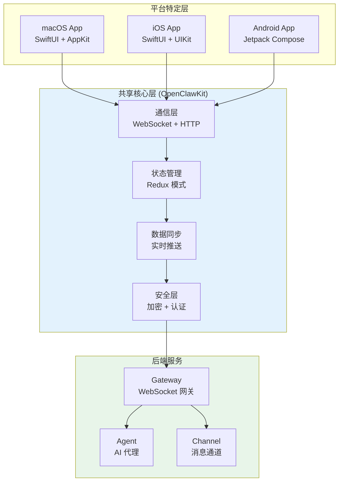
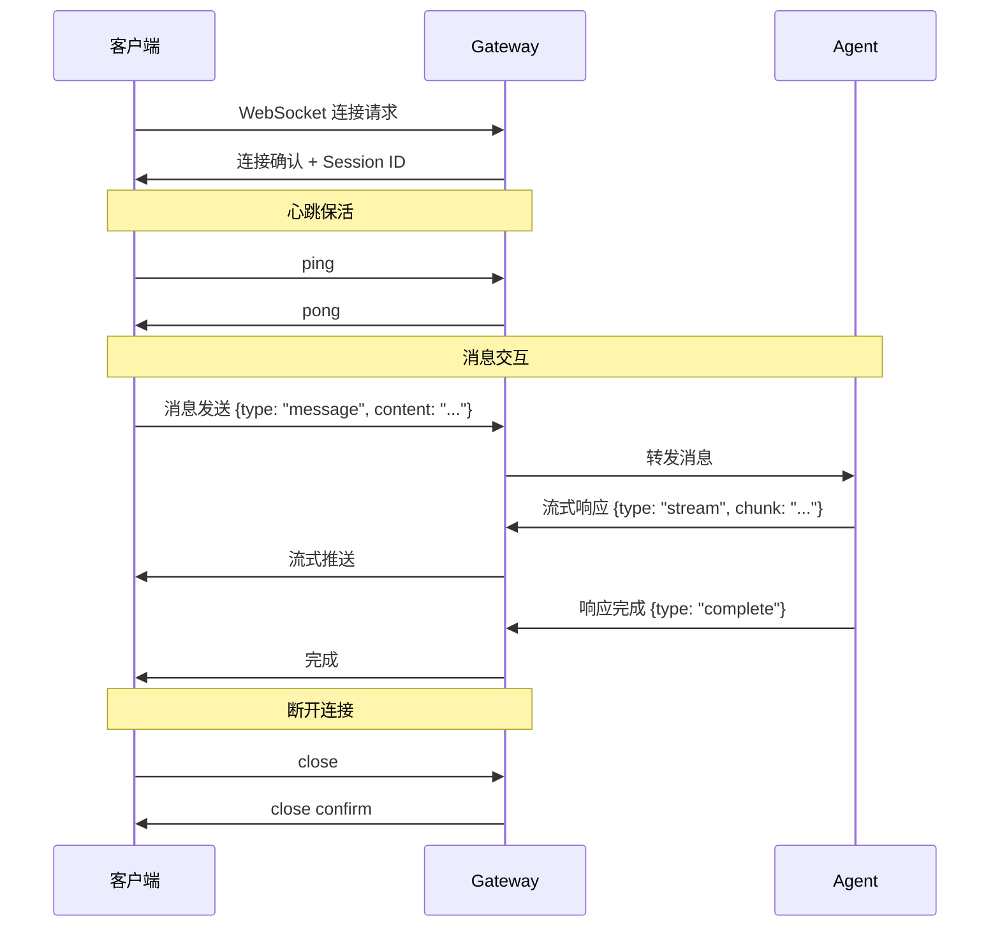
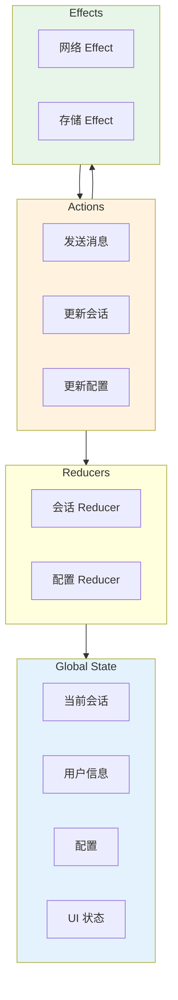

> **学习目标**：理解 OpenClaw 如何实现跨平台客户端
> **前置知识**：第1-12章（项目概览到工具系统）
> **源码路径**：`apps/`
> **阅读时间**：50分钟

<SourceSnapshotCard
  repo="openclaw/openclaw"
  branch="main"
  commit="latest"
  :entries="[
    { label: '客户端入口', path: 'apps/' },
    { label: '共享核心', path: 'apps/shared/OpenClawKit/' }
  ]"
/>

## 13.1 概念引入

### 13.1.1 为什么需要跨平台客户端？

OpenClaw 支持**多平台使用**：
- **macOS**：桌面原生应用
- **iOS**：移动端应用
- **Android**：移动端应用
- **Web**：浏览器访问（通过 Gateway）

**跨平台策略**：共享核心逻辑 + 平台特定 UI

### 13.1.2 客户端架构总览



## 13.2 共享核心 OpenClawKit

### 13.2.1 OpenClawKit 模块结构

```mermaid
flowchart LR
    subgraph OpenClawKit["OpenClawKit (Swift/Kotlin)"]
        Core["Core<br/>核心类型"]
        Network["Network<br/>网络通信"]
        State["State<br/>状态管理"]
        Crypto["Crypto<br/>加密工具"]
        Storage["Storage<br">本地存储"]
    end
    
    subgraph 平台适配["平台适配"]
        SwiftAdapter["Swift Adapter"]
        KotlinAdapter["Kotlin Adapter"]
    end
    
    Core --> SwiftAdapter
    Core --> KotlinAdapter
    Network --> SwiftAdapter
    Network --> KotlinAdapter
    State --> SwiftAdapter
    State --> KotlinAdapter
    
    style OpenClawKit fill:#fff3e0
```

### 13.2.2 核心类型定义

```swift
// Swift - OpenClawKit/Core/Types.swift

/// 会话模型
public struct Session: Codable, Identifiable {
    public let id: String
    public let title: String
    public let createdAt: Date
    public let updatedAt: Date
    public var messages: [Message]
}

/// 消息模型
public struct Message: Codable, Identifiable {
    public let id: String
    public let role: MessageRole
    public let content: String
    public let timestamp: Date
    public var attachments: [Attachment]?
}

/// 消息角色
public enum MessageRole: String, Codable {
    case user
    case assistant
    case system
    case tool
}

/// 附件类型
public struct Attachment: Codable {
    public let type: AttachmentType
    public let url: String
    public let name: String?
    public let size: Int?
}

public enum AttachmentType: String, Codable {
    case image
    case file
    case audio
    case video
}
```

```kotlin
// Kotlin - OpenClawKit/Core/Types.kt

data class Session(
    val id: String,
    val title: String,
    val createdAt: Long,
    val updatedAt: Long,
    var messages: List<Message>
)

data class Message(
    val id: String,
    val role: MessageRole,
    val content: String,
    val timestamp: Long,
    val attachments: List<Attachment>? = null
)

enum class MessageRole {
    USER, ASSISTANT, SYSTEM, TOOL
}

data class Attachment(
    val type: AttachmentType,
    val url: String,
    val name: String? = null,
    val size: Long? = null
)

enum class AttachmentType {
    IMAGE, FILE, AUDIO, VIDEO
}
```

## 13.3 通信层设计

### 13.3.1 WebSocket 通信协议



### 13.3.2 消息协议格式

```swift
// Swift - 网络消息协议

/// 发送消息请求
struct SendMessageRequest: Codable {
    let type = "message"
    let sessionId: String
    let content: String
    let attachments: [Attachment]?
}

/// 流式响应
struct StreamChunk: Codable {
    let type = "stream"
    let sessionId: String
    let messageId: String
    let chunk: String
    let done: Bool
}

/// 完成响应
struct CompleteResponse: Codable {
    let type = "complete"
    let sessionId: String
    let messageId: String
    let usage: Usage?
}

/// 错误响应
struct ErrorResponse: Codable {
    let type = "error"
    let code: String
    let message: String
}
```

### 13.3.3 WebSocket 客户端实现

```swift
// Swift - WebSocketClient.swift

public class WebSocketClient: ObservableObject {
    private var webSocket: URLSessionWebSocketTask?
    private let url: URL
    private let session: URLSession
    
    @Published public var isConnected = false
    @Published public var connectionState: ConnectionState = .disconnected
    
    // 消息回调
    public var onMessage: ((Data) -> Void)?
    public var onStream: ((StreamChunk) -> Void)?
    public var onError: ((Error) -> Void)?
    
    public init(url: URL) {
        self.url = url
        self.session = URLSession(configuration: .default)
    }
    
    public func connect() async throws {
        var request = URLRequest(url: url)
        request.setValue("Bearer \(getToken())", forHTTPHeaderField: "Authorization")
        
        webSocket = session.webSocketTask(with: request)
        webSocket?.resume()
        
        // 启动消息接收循环
        await receiveMessages()
        
        await MainActor.run {
            self.isConnected = true
            self.connectionState = .connected
        }
    }
    
    public func disconnect() {
        webSocket?.cancel(with: .normalClosure, reason: nil)
        isConnected = false
        connectionState = .disconnected
    }
    
    public func send<T: Codable>(_ message: T) async throws {
        let data = try JSONEncoder().encode(message)
        let task = webSocket?.send(.data(data)) { error in
            if let error = error {
                print("Send error: \(error)")
            }
        }
    }
    
    private func receiveMessages() async {
        while let webSocket = webSocket {
            do {
                let message = try await webSocket.receive()
                
                switch message {
                case .data(let data):
                    handleMessage(data)
                case .string(let string):
                    handleMessage(Data(string.utf8))
                @unknown default:
                    break
                }
            } catch {
                print("Receive error: \(error)")
                break
            }
        }
    }
    
    private func handleMessage(_ data: Data) {
        guard let json = try? JSONDecoder().decode(BaseMessage.self, from: data) else {
            return
        }
        
        switch json.type {
        case "stream":
            if let chunk = try? JSONDecoder().decode(StreamChunk.self, from: data) {
                onStream?(chunk)
            }
        case "complete":
            if let response = try? JSONDecoder().decode(CompleteResponse.self, from: data) {
                // 处理完成
            }
        case "error":
            if let error = try? JSONDecoder().decode(ErrorResponse.self, from: data) {
                onError?(NSError(domain: error.code, code: 0, userInfo: [NSLocalizedDescriptionKey: error.message]))
            }
        default:
            onMessage?(data)
        }
    }
}
```

## 13.4 状态管理

### 13.4.1 状态架构



### 13.4.2 SwiftUI 状态管理

```swift
// Swift - AppState.swift

@MainActor
@Observable
public class AppState {
    // 全局状态
    public var sessions: [Session] = []
    public var currentSession: Session?
    public var user: User?
    public var config: AppConfig = .default
    
    // UI 状态
    public var isLoading = false
    public var error: Error?
    public var showingSettings = false
    
    // 服务依赖
    private let webSocketClient: WebSocketClient
    private let storageService: StorageService
    
    public init(webSocketClient: WebSocketClient, storageService: StorageService) {
        self.webSocketClient = webSocketClient
        self.storageService = storageService
        
        setupCallbacks()
    }
    
    // 发送消息
    public func sendMessage(_ content: String, attachments: [Attachment]? = nil) async {
        guard let session = currentSession else { return }
        
        // 创建用户消息
        let userMessage = Message(
            id: UUID().uuidString,
            role: .user,
            content: content,
            timestamp: Date(),
            attachments: attachments
        )
        
        // 添加到会话
        currentSession?.messages.append(userMessage)
        
        // 发送到服务器
        do {
            let request = SendMessageRequest(
                sessionId: session.id,
                content: content,
                attachments: attachments
            )
            try await webSocketClient.send(request)
        } catch {
            self.error = error
        }
    }
    
    // 处理流式响应
    private func setupCallbacks() {
        webSocketClient.onStream = { [weak self] chunk in
            Task { @MainActor in
                self?.handleStreamChunk(chunk)
            }
        }
        
        webSocketClient.onError = { [weak self] error in
            Task { @MainActor in
                self?.error = error
            }
        }
    }
    
    private func handleStreamChunk(_ chunk: StreamChunk) {
        guard let session = currentSession else { return }
        
        // 找到或创建助手消息
        if let lastMessage = session.messages.last,
           lastMessage.id == chunk.messageId {
            // 追加内容
            var updated = session.messages
            updated[updated.count - 1].content += chunk.chunk
            currentSession?.messages = updated
        } else {
            // 创建新消息
            let assistantMessage = Message(
                id: chunk.messageId,
                role: .assistant,
                content: chunk.chunk,
                timestamp: Date()
            )
            currentSession?.messages.append(assistantMessage)
        }
    }
}
```

## 13.5 平台适配层

### 13.5.1 平台差异处理

```swift
// Swift - 平台适配

#if os(macOS)
import AppKit
typealias PlatformImage = NSImage
typealias PlatformColor = NSColor
#elseif os(iOS)
import UIKit
typealias PlatformImage = UIImage
typealias PlatformColor = UIColor
#endif

// 平台特定功能
public protocol PlatformAdapter {
    var isDarkMode: Bool { get }
    func openURL(_ url: URL)
    func copyToClipboard(_ text: String)
    func share(_ items: [Any])
}

#if os(macOS)
public class macOSAdapter: PlatformAdapter {
    public var isDarkMode: Bool {
        NSApp.effectiveAppearance.name == .darkAqua
    }
    
    public func openURL(_ url: URL) {
        NSWorkspace.shared.open(url)
    }
    
    public func copyToClipboard(_ text: String) {
        NSPasteboard.general.clearContents()
        NSPasteboard.general.setString(text, forType: .string)
    }
    
    public func share(_ items: [Any]) {
        let picker = NSSharingServicePicker(items: items)
        picker.show(relativeTo: .zero, of: NSApp.keyWindow!.contentView!, preferredEdge: .minY)
    }
}
#elseif os(iOS)
public class iOSAdapter: PlatformAdapter {
    public var isDarkMode: Bool {
        UITraitCollection.current.userInterfaceStyle == .dark
    }
    
    public func openURL(_ url: URL) {
        UIApplication.shared.open(url)
    }
    
    public func copyToClipboard(_ text: String) {
        UIPasteboard.general.string = text
    }
    
    public func share(_ items: [Any]) {
        let activityVC = UIActivityViewController(activityItems: items, applicationActivities: nil)
        UIApplication.shared.keyWindow?.rootViewController?.present(activityVC, animated: true)
    }
}
#endif
```

## 13.6 本地存储

### 13.6.1 存储架构

```swift
// Swift - StorageService.swift

public protocol StorageService {
    func save<T: Codable>(_ value: T, forKey key: String) async throws
    func load<T: Codable>(_ type: T.Type, forKey key: String) async throws -> T?
    func delete(forKey key: String) async throws
    func clear() async throws
}

// CoreData 实现
public class CoreDataStorage: StorageService {
    private let container: NSPersistentContainer
    
    public init() {
        container = NSPersistentContainer(name: "OpenClaw")
        container.loadPersistentStores { _, error in
            if let error = error {
                fatalError("CoreData error: \(error)")
            }
        }
    }
    
    public func save<T: Codable>(_ value: T, forKey key: String) async throws {
        let context = container.viewContext
        let entity = StorageEntity(context: context)
        entity.key = key
        entity.data = try JSONEncoder().encode(value)
        entity.updatedAt = Date()
        try context.save()
    }
    
    public func load<T: Codable>(_ type: T.Type, forKey key: String) async throws -> T? {
        let context = container.viewContext
        let request: NSFetchRequest<StorageEntity> = StorageEntity.fetchRequest()
        request.predicate = NSPredicate(format: "key == %@", key)
        
        guard let entity = try context.fetch(request).first else {
            return nil
        }
        
        return try JSONDecoder().decode(type, from: entity.data!)
    }
    
    public func delete(forKey key: String) async throws {
        let context = container.viewContext
        let request: NSFetchRequest<StorageEntity> = StorageEntity.fetchRequest()
        request.predicate = NSPredicate(format: "key == %@", key)
        
        let entities = try context.fetch(request)
        entities.forEach { context.delete($0) }
        try context.save()
    }
    
    public func clear() async throws {
        let context = container.viewContext
        let request: NSBatchDeleteRequest = NSBatchDeleteRequest(fetchRequest: StorageEntity.fetchRequest())
        try context.execute(request)
    }
}
```

## 13.7 概念→代码映射表

| 概念组件 | 对应目录/文件 | 核心作用 |
|---------|-------------|---------|
| **OpenClawKit** | `apps/shared/OpenClawKit/` | 共享核心库 |
| **WebSocket 客户端** | `OpenClawKit/Network/` | 实时通信 |
| **状态管理** | `OpenClawKit/State/` | 全局状态 |
| **平台适配** | `OpenClawKit/Platform/` | 平台差异 |
| **本地存储** | `OpenClawKit/Storage/` | 数据持久化 |

## 13.8 小结

客户端架构采用**共享核心 + 平台适配**模式：
- OpenClawKit：跨平台共享代码
- 平台适配层：处理平台差异
- WebSocket 通信：实时双向通信

理解客户端架构后，可以开发各平台原生应用。

---

**下一章**：[第14章：macOS 应用](/13-macos/) - 深入了解 macOS 桌面应用开发
