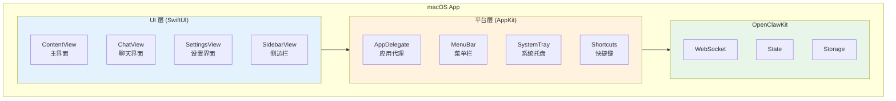
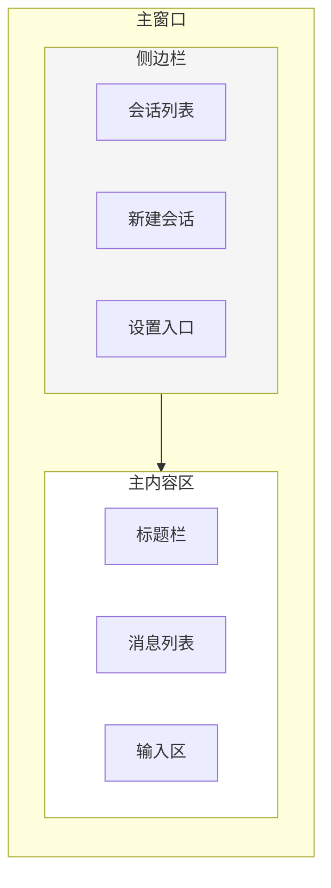

> **学习目标**：理解 OpenClaw macOS 应用的设计和实现
> **前置知识**：第13章（客户端架构）
> **源码路径**：`apps/macos/`
> **阅读时间**：45分钟

<SourceSnapshotCard
  repo="openclaw/openclaw"
  branch="main"
  commit="latest"
  :entries="[
    { label: 'macOS 入口', path: 'apps/macos/' },
    { label: 'UI 组件', path: 'apps/macos/OpenClaw/' }
  ]"
/>

## 14.1 概念引入

### 14.1.1 macOS 应用特点

**桌面应用优势**：
- **系统集成**：菜单栏、Dock、通知中心
- **键盘快捷键**：全局快捷键支持
- **文件访问**：直接读写本地文件
- **多窗口**：支持多窗口、分屏
- **后台运行**：常驻系统托盘

### 14.1.2 应用架构



## 14.2 UI 层设计

### 14.2.1 主界面结构



### 14.2.2 SwiftUI 实现

```swift
// macOS/OpenClaw/ContentView.swift

import SwiftUI

struct ContentView: View {
    @Bindable var appState: AppState
    @State private var selectedSessionId: String?
    
    var body: some View {
        NavigationSplitView {
            // 侧边栏
            SidebarView(
                sessions: appState.sessions,
                selectedSessionId: $selectedSessionId,
                onNewSession: { Task { await createNewSession() } }
            )
            .navigationSplitViewColumnWidth(min: 200, ideal: 250)
        } detail: {
            // 主内容区
            if let sessionId = selectedSessionId,
               let session = appState.sessions.first(where: { $0.id == sessionId }) {
                ChatView(session: session, appState: appState)
            } else {
                EmptyStateView()
            }
        }
        .toolbar {
            ToolbarItemGroup {
                Button(action: { Task { await createNewSession() } }) {
                    Label("新建会话", systemImage: "square.and.pencil")
                }
                
                Button(action: { appState.showingSettings = true }) {
                    Label("设置", systemImage: "gear")
                }
            }
        }
        .sheet(isPresented: $appState.showingSettings) {
            SettingsView(config: $appState.config)
        }
    }
    
    private func createNewSession() async {
        let session = Session(
            id: UUID().uuidString,
            title: "新会话",
            createdAt: Date(),
            updatedAt: Date(),
            messages: []
        )
        appState.sessions.append(session)
        selectedSessionId = session.id
    }
}
```

### 14.2.3 聊天界面

```swift
// macOS/OpenClaw/ChatView.swift

import SwiftUI

struct ChatView: View {
    @Bindable var session: Session
    @Bindable var appState: AppState
    @State private var inputText = ""
    @FocusState private var isInputFocused: Bool
    
    var body: some View {
        VStack(spacing: 0) {
            // 消息列表
            ScrollViewReader { proxy in
                ScrollView {
                    LazyVStack(spacing: 12) {
                        ForEach(session.messages) { message in
                            MessageView(message: message)
                                .id(message.id)
                        }
                    }
                    .padding()
                }
                .onChange(of: session.messages.count) { _, _ in
                    if let lastMessage = session.messages.last {
                        withAnimation {
                            proxy.scrollTo(lastMessage.id, anchor: .bottom)
                        }
                    }
                }
            }
            
            Divider()
            
            // 输入区
            InputArea(
                text: $inputText,
                isFocused: $isInputFocused,
                isLoading: appState.isLoading,
                onSend: sendMessage
            )
        }
        .navigationTitle(session.title)
        .navigationSubtitle(subtitle)
    }
    
    private var subtitle: String {
        let messageCount = session.messages.count
        return "\(messageCount) 条消息"
    }
    
    private func sendMessage() {
        guard !inputText.trimmingCharacters(in: .whitespacesAndNewlines).isEmpty else { return }
        
        let content = inputText
        inputText = ""
        
        Task {
            await appState.sendMessage(content)
        }
    }
}

// 消息视图
struct MessageView: View {
    let message: Message
    
    var body: some View {
        HStack(alignment: .top, spacing: 12) {
            // 头像
            Circle()
                .fill(avatarColor)
                .frame(width: 32, height: 32)
                .overlay {
                    Text(avatarText)
                        .font(.caption)
                        .fontWeight(.bold)
                        .foregroundColor(.white)
                }
            
            // 内容
            VStack(alignment: .leading, spacing: 4) {
                Text(roleText)
                    .font(.caption)
                    .foregroundColor(.secondary)
                
                Text(message.content)
                    .textSelection(.enabled)
                
                if let attachments = message.attachments, !attachments.isEmpty {
                    AttachmentsView(attachments: attachments)
                }
            }
            
            Spacer()
        }
    }
    
    private var avatarColor: Color {
        switch message.role {
        case .user: return .blue
        case .assistant: return .green
        case .system: return .gray
        case .tool: return .orange
        }
    }
    
    private var avatarText: String {
        switch message.role {
        case .user: return "U"
        case .assistant: return "AI"
        case .system: return "S"
        case .tool: return "T"
        }
    }
    
    private var roleText: String {
        switch message.role {
        case .user: return "你"
        case .assistant: return "AI 助手"
        case .system: return "系统"
        case .tool: return "工具"
        }
    }
}
```

## 14.3 平台集成

### 14.3.1 应用代理

```swift
// macOS/OpenClaw/OpenClawApp.swift

import SwiftUI

@main
struct OpenClawApp: App {
    @State private var appState: AppState
    @NSApplicationDelegateAdaptor private var appDelegate: AppDelegate
    
    init() {
        // 初始化服务
        let webSocketClient = WebSocketClient(url: Config.default.gatewayURL)
        let storageService = CoreDataStorage()
        
        _appState = State(initialValue: AppState(
            webSocketClient: webSocketClient,
            storageService: storageService
        ))
    }
    
    var body: some Scene {
        WindowGroup {
            ContentView(appState: appState)
                .frame(minWidth: 800, minHeight: 600)
                .onAppear {
                    Task {
                        await appState.connect()
                    }
                }
        }
        .commands {
            // 自定义菜单命令
            CommandGroup(replacing: .newItem) {
                Button("新建会话") {
                    Task { await createNewSession() }
                }
                .keyboardShortcut("n", modifiers: .command)
            }
            
            CommandGroup(after: .windowArrangement) {
                Button("始终在最前面") {
                    NSApp.windows.first?.level = .floating
                }
            }
        }
        
        // 设置窗口
        Settings {
            SettingsView(config: $appState.config)
        }
        
        // 系统托盘
        MenuBarExtra("OpenClaw", systemImage: "bubble.left.and.bubble.right") {
            TrayMenuView(appState: appState)
        }
    }
    
    private func createNewSession() async {
        // 创建新会话逻辑
    }
}
```

### 14.3.2 菜单栏

```swift
// macOS/OpenClaw/MenuBar.swift

import SwiftUI

struct MenuBarCommands: Commands {
    @Bindable var appState: AppState
    
    var body: some Commands {
        // 文件菜单
        CommandGroup(replacing: .newItem) {
            Button("新建会话") {
                // 创建新会话
            }
            .keyboardShortcut("n", modifiers: .command)
            
            Divider()
            
            Button("导出会话...") {
                exportSession()
            }
            .keyboardShortcut("e", modifiers: .command)
        }
        
        // 编辑菜单
        CommandGroup(after: .pasteboard) {
            Button("清空会话") {
                clearCurrentSession()
            }
            .keyboardShortcut("delete", modifiers: [.command, .shift])
        }
        
        // 视图菜单
        CommandGroup(after: .sidebar) {
            Picker("侧边栏位置", selection: $appState.config.sidebarPosition) {
                Text("左侧").tag(SidebarPosition.left)
                Text("右侧").tag(SidebarPosition.right)
            }
            .pickerStyle(.inline)
        }
    }
    
    private func exportSession() {
        let panel = NSSavePanel()
        panel.allowedContentTypes = [.json]
        panel.nameFieldStringValue = "session.json"
        
        if panel.runModal() == .OK, let url = panel.url {
            // 导出会话
        }
    }
    
    private func clearCurrentSession() {
        // 清空当前会话
    }
}
```

### 14.3.3 系统托盘

```swift
// macOS/OpenClaw/SystemTray.swift

import SwiftUI

struct TrayMenuView: View {
    @Bindable var appState: AppState
    
    var body: some View {
        Group {
            Button("新建会话") {
                NSApp.windows.first?.makeKeyAndOrderFront(nil)
                Task { await createNewSession() }
            }
            
            Divider()
            
            if let session = appState.currentSession {
                Text("当前: \(session.title)")
                
                Button("继续对话") {
                    NSApp.windows.first?.makeKeyAndOrderFront(nil)
                }
            }
            
            Divider()
            
            Toggle("始终显示", isOn: $appState.config.alwaysOnTop)
            
            Button("设置...") {
                NSApp.sendAction(Selector(("showSettingsWindow:")), to: nil, from: nil)
            }
            
            Divider()
            
            Button("退出") {
                NSApp.terminate(nil)
            }
        }
    }
    
    private func createNewSession() async {
        // 创建新会话
    }
}
```

## 14.4 快捷键支持

### 14.4.1 全局快捷键

```swift
// macOS/OpenClaw/Shortcuts.swift

import Carbon
import SwiftUI

class ShortcutManager {
    static let shared = ShortcutManager()
    
    private var hotKeyRef: EventHotKeyRef?
    
    func registerGlobalShortcut() {
        // Cmd+Shift+O 显示/隐藏窗口
        var hotKeyID = EventHotKeyID()
        hotKeyID.id = 1
        hotKeyID.signature = OSType(0x4F434C57) // "OCLW"
        
        RegisterEventHotKey(
            UInt32(kVK_ANSI_O),
            UInt32(cmdKey | shiftKey),
            &hotKeyID,
            GetEventMonitorTarget(),
            0,
            &hotKeyRef
        )
        
        // 安装事件处理器
        installEventHandler()
    }
    
    private func installEventHandler() {
        var eventType = EventTypeSpec(
            eventClass: OSType(kEventClassKeyboard),
            eventKind: UInt32(kEventHotKeyPressed)
        )
        
        InstallEventHandler(
            GetEventMonitorTarget(),
            { _, event, _ -> OSStatus in
                // 显示/隐藏窗口
                DispatchQueue.main.async {
                    if let window = NSApp.windows.first {
                        if window.isVisible {
                            window.orderOut(nil)
                        } else {
                            window.makeKeyAndOrderFront(nil)
                            NSApp.activate(ignoringOtherApps: true)
                        }
                    }
                }
                return noErr
            },
            1,
            &eventType,
            nil,
            nil
        )
    }
}
```

### 14.4.2 应用内快捷键

```swift
// macOS/OpenClaw/KeyboardShortcuts.swift

import SwiftUI

extension View {
    func setupKeyboardShortcuts(appState: AppState) -> some View {
        self
            .onKeyPress(.return, modifiers: .command) {
                // Cmd+Enter 发送消息
                Task { await appState.sendMessage("") }
                return .handled
            }
            .onKeyPress(.delete, modifiers: [.command, .shift]) {
                // Cmd+Shift+Delete 清空会话
                // clearSession()
                return .handled
            }
            .onKeyPress(",", modifiers: .command) {
                // Cmd+, 打开设置
                appState.showingSettings = true
                return .handled
            }
    }
}
```

## 14.5 通知集成

### 14.5.1 本地通知

```swift
// macOS/OpenClaw/Notifications.swift

import UserNotifications

class NotificationManager {
    static let shared = NotificationManager()
    
    func requestAuthorization() async throws {
        let center = UNUserNotificationCenter.current()
        try await center.requestAuthorization(options: [.alert, .sound, .badge])
    }
    
    func sendNotification(title: String, body: String) async throws {
        let center = UNUserNotificationCenter.current()
        
        let content = UNMutableNotificationContent()
        content.title = title
        content.body = body
        content.sound = .default
        
        let request = UNNotificationRequest(
            identifier: UUID().uuidString,
            content: content,
            trigger: nil  // 立即发送
        )
        
        try await center.add(request)
    }
    
    // AI 响应完成通知
    func notifyResponseReceived(sessionTitle: String) async {
        try? await sendNotification(
            title: "OpenClaw",
            body: "「\(sessionTitle)」收到新回复"
        )
    }
}
```

## 14.6 概念→代码映射表

| 概念组件 | 对应目录/文件 | 核心作用 |
|---------|-------------|---------|
| **ContentView** | `apps/macos/OpenClaw/ContentView.swift` | 主界面 |
| **ChatView** | `apps/macos/OpenClaw/ChatView.swift` | 聊天界面 |
| **AppDelegate** | `apps/macos/OpenClaw/AppDelegate.swift` | 应用生命周期 |
| **MenuBar** | `apps/macos/OpenClaw/MenuBar.swift` | 菜单栏 |
| **SystemTray** | `apps/macos/OpenClaw/SystemTray.swift` | 系统托盘 |
| **Shortcuts** | `apps/macos/OpenClaw/Shortcuts.swift` | 快捷键 |

## 14.7 小结

macOS 应用利用 SwiftUI 和 AppKit 提供**原生桌面体验**：
- SwiftUI UI：现代化声明式界面
- AppKit 集成：菜单栏、托盘、快捷键
- 系统通知：本地通知集成

---

**下一章**：[第15章：iOS 与 Android](/14-mobile/) - 了解移动端应用开发
