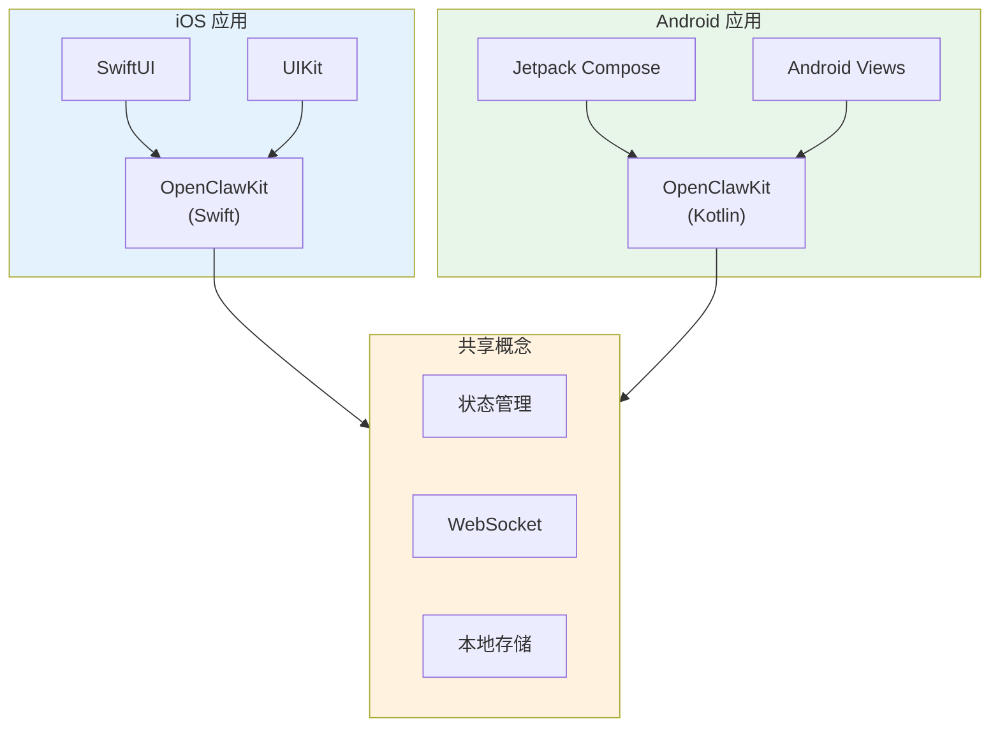

> **学习目标**：理解 OpenClaw iOS 和 Android 应用的设计和实现
> **前置知识**：第13-14章（客户端架构、macOS 应用）
> **源码路径**：`apps/ios/`、`apps/android/`
> **阅读时间**：45分钟

<SourceSnapshotCard
  repo="openclaw/openclaw"
  branch="main"
  commit="latest"
  :entries="[
    { label: 'iOS 入口', path: 'apps/ios/' },
    { label: 'Android 入口', path: 'apps/android/' }
  ]"
/>

## 15.1 概念引入

### 15.1.1 移动端应用特点

**移动端优势**：
- **随时使用**：随时随地访问 AI 助手
- **推送通知**：及时响应消息
- **生物识别**：Face ID / Touch ID 安全认证
- **相机集成**：拍照识别、图片理解
- **语音输入**：语音转文字输入

### 15.1.2 移动端架构对比



## 15.2 iOS 应用

### 15.2.1 应用架构

```swift
// iOS/OpenClaw/OpenClawApp.swift

import SwiftUI

@main
struct OpenClawiOSApp: App {
    @State private var appState: AppState
    
    init() {
        let webSocketClient = WebSocketClient(url: Config.default.gatewayURL)
        let storageService = CoreDataStorage()
        
        _appState = State(initialValue: AppState(
            webSocketClient: webSocketClient,
            storageService: storageService
        ))
    }
    
    var body: some Scene {
        WindowGroup {
            ContentView(appState: appState)
                .onAppear {
                    Task { await appState.connect() }
                }
        }
    }
}
```

### 15.2.2 主界面

```swift
// iOS/OpenClaw/ContentView.swift

import SwiftUI

struct ContentView: View {
    @Bindable var appState: AppState
    @State private var showingNewSession = false
    
    var body: some View {
        NavigationStack {
            SessionListView(appState: appState)
                .navigationTitle("OpenClaw")
                .toolbar {
                    ToolbarItem(placement: .primaryAction) {
                        Button {
                            showingNewSession = true
                        } label: {
                            Image(systemName: "square.and.pencil")
                        }
                    }
                    
                    ToolbarItem(placement: .secondaryAction) {
                        Button {
                            appState.showingSettings = true
                        } label: {
                            Image(systemName: "gear")
                        }
                    }
                }
                .sheet(isPresented: $showingNewSession) {
                    NavigationStack {
                        ChatView(
                            session: Session(
                                id: UUID().uuidString,
                                title: "新会话",
                                createdAt: Date(),
                                updatedAt: Date(),
                                messages: []
                            ),
                            appState: appState
                        )
                    }
                }
                .sheet(isPresented: $appState.showingSettings) {
                    SettingsView(config: $appState.config)
                }
        }
    }
}
```

### 15.2.3 会话列表

```swift
// iOS/OpenClaw/SessionListView.swift

import SwiftUI

struct SessionListView: View {
    @Bindable var appState: AppState
    @State private var editMode: EditMode = .inactive
    
    var body: some View {
        List {
            ForEach(appState.sessions) { session in
                NavigationLink(value: session) {
                    SessionRowView(session: session)
                }
            }
            .onDelete(perform: deleteSessions)
            .onMove(perform: moveSessions)
        }
        .navigationDestination(for: Session.self) { session in
            ChatView(session: session, appState: appState)
        }
        .environment(\.editMode, $editMode)
        .refreshable {
            await refreshSessions()
        }
    }
    
    private func deleteSessions(at offsets: IndexSet) {
        appState.sessions.remove(atOffsets: offsets)
    }
    
    private func moveSessions(from source: IndexSet, to destination: Int) {
        appState.sessions.move(fromOffsets: source, toOffset: destination)
    }
    
    private func refreshSessions() async {
        // 刷新会话列表
    }
}

struct SessionRowView: View {
    let session: Session
    
    var body: some View {
        VStack(alignment: .leading, spacing: 4) {
            Text(session.title)
                .font(.headline)
                .lineLimit(1)
            
            if let lastMessage = session.messages.last {
                Text(lastMessage.content)
                    .font(.subheadline)
                    .foregroundColor(.secondary)
                    .lineLimit(2)
            }
            
            Text(session.updatedAt, style: .relative)
                .font(.caption)
                .foregroundColor(.secondary)
        }
        .padding(.vertical, 4)
    }
}
```

### 15.2.4 聊天界面（移动端优化）

```swift
// iOS/OpenClaw/ChatView.swift

import SwiftUI

struct ChatView: View {
    @Bindable var session: Session
    @Bindable var appState: AppState
    @State private var inputText = ""
    @State private var showingAttachment = false
    @FocusState private var isInputFocused: Bool
    
    var body: some View {
        VStack(spacing: 0) {
            // 消息列表
            ScrollViewReader { proxy in
                ScrollView {
                    LazyVStack(spacing: 12) {
                        ForEach(session.messages) { message in
                            MessageBubbleView(message: message)
                                .id(message.id)
                        }
                    }
                    .padding()
                }
                .onChange(of: session.messages.count) { _, _ in
                    if let lastMessage = session.messages.last {
                        withAnimation {
                            proxy.scrollTo(lastMessage.id, anchor: .bottom)
                        }
                    }
                }
            }
            
            // 输入区
            InputBarView(
                text: $inputText,
                isFocused: $isInputFocused,
                isLoading: appState.isLoading,
                onSend: sendMessage,
                onAttach: { showingAttachment = true }
            )
        }
        .navigationTitle(session.title)
        .navigationBarTitleDisplayMode(.inline)
        .toolbar {
            ToolbarItem(placement: .primaryAction) {
                Menu {
                    Button("清空会话", role: .destructive) {
                        // clearSession()
                    }
                    
                    Button("导出会话") {
                        // exportSession()
                    }
                } label: {
                    Image(systemName: "ellipsis.circle")
                }
            }
        }
        .sheet(isPresented: $showingAttachment) {
            AttachmentPickerView(onSelect: handleAttachment)
                .presentationDetents([.medium])
        }
    }
    
    private func sendMessage() {
        guard !inputText.trimmingCharacters(in: .whitespacesAndNewlines).isEmpty else { return }
        
        let content = inputText
        inputText = ""
        isInputFocused = false
        
        Task {
            await appState.sendMessage(content)
        }
    }
    
    private func handleAttachment(_ result: AttachmentResult) {
        Task {
            await appState.sendMessage("", attachments: [result.attachment])
        }
    }
}

// 消息气泡（移动端优化）
struct MessageBubbleView: View {
    let message: Message
    
    var body: some View {
        HStack(alignment: .bottom, spacing: 8) {
            if message.role == .user {
                Spacer()
            }
            
            VStack(alignment: message.role == .user ? .trailing : .leading, spacing: 4) {
                Text(message.content)
                    .padding(.horizontal, 16)
                    .padding(.vertical, 10)
                    .background(backgroundColor)
                    .foregroundColor(textColor)
                    .cornerRadius(18)
                
                if let attachments = message.attachments, !attachments.isEmpty {
                    AttachmentsGridView(attachments: attachments)
                }
                
                Text(message.timestamp, style: .time)
                    .font(.caption2)
                    .foregroundColor(.secondary)
            }
            
            if message.role != .user {
                Spacer()
            }
        }
    }
    
    private var backgroundColor: Color {
        switch message.role {
        case .user: return .blue
        case .assistant: return Color(.systemGray5)
        case .system, .tool: return Color(.systemGray6)
        }
    }
    
    private var textColor: Color {
        switch message.role {
        case .user: return .white
        default: return .primary
        }
    }
}
```

### 15.2.5 附件选择器

```swift
// iOS/OpenClaw/AttachmentPickerView.swift

import SwiftUI
import PhotosUI

struct AttachmentPickerView: View {
    let onSelect: (AttachmentResult) -> Void
    @State private var selectedItem: PhotosPickerItem?
    @State private var showingCamera = false
    @Environment(\.dismiss) private var dismiss
    
    var body: some View {
        NavigationStack {
            List {
                Section("选择来源") {
                    Button {
                        showingCamera = true
                    } label: {
                        Label("相机", systemImage: "camera")
                    }
                    
                    PhotosPicker(selection: $selectedItem, matching: .images) {
                        Label("相册", systemImage: "photo")
                    }
                    
                    Button {
                        // 文件选择
                    } label: {
                        Label("文件", systemImage: "folder")
                    }
                }
            }
            .navigationTitle("添加附件")
            .navigationBarTitleDisplayMode(.inline)
            .toolbar {
                ToolbarItem(placement: .cancellationAction) {
                    Button("取消") {
                        dismiss()
                    }
                }
            }
            .onChange(of: selectedItem) { _, newItem in
                if let newItem = newItem {
                    Task {
                        if let data = try? await newItem.loadTransferable(type: Data.self) {
                            let attachment = Attachment(
                                type: .image,
                                url: "data:image/jpeg;base64,\(data.base64EncodedString())",
                                name: "image.jpg"
                            )
                            onSelect(AttachmentResult(attachment: attachment))
                            dismiss()
                        }
                    }
                }
            }
            .fullScreenCover(isPresented: $showingCamera) {
                CameraView { image in
                    if let data = image.jpegData(compressionQuality: 0.8) {
                        let attachment = Attachment(
                            type: .image,
                            url: "data:image/jpeg;base64,\(data.base64EncodedString())",
                            name: "camera.jpg"
                        )
                        onSelect(AttachmentResult(attachment: attachment))
                    }
                    dismiss()
                }
            }
        }
    }
}

struct AttachmentResult {
    let attachment: Attachment
}
```

## 15.3 Android 应用

### 15.3.1 应用架构

```kotlin
// Android/app/src/main/java/com/openclaw/app/OpenClawApp.kt

class OpenClawApp : Application() {
    lateinit var container: AppContainer
    
    override fun onCreate() {
        super.onCreate()
        container = AppContainer(this)
    }
}

class AppContainer(context: Context) {
    val webSocketClient = WebSocketClient(Config.gatewayUrl)
    val storageService = RoomStorage(context)
    val appState = AppState(webSocketClient, storageService)
}
```

### 15.3.2 主界面（Jetpack Compose）

```kotlin
// Android/app/src/main/java/com/openclaw/app/ui/MainActivity.kt

class MainActivity : ComponentActivity() {
    private val appState by lazy {
        (application as OpenClawApp).container.appState
    }
    
    override fun onCreate(savedInstanceState: Bundle?) {
        super.onCreate(savedInstanceState)
        setContent {
            OpenClawTheme {
                OpenClawApp(appState = appState)
            }
        }
        
        lifecycleScope.launch {
            appState.connect()
        }
    }
}

@Composable
fun OpenClawApp(appState: AppState) {
    val navController = rememberNavController()
    
    NavHost(navController = navController, startDestination = "sessions") {
        composable("sessions") {
            SessionListScreen(
                appState = appState,
                onSessionClick = { session ->
                    navController.navigate("chat/${session.id}")
                },
                onNewSession = {
                    navController.navigate("chat/new")
                }
            )
        }
        composable(
            route = "chat/{sessionId}",
            arguments = listOf(navArgument("sessionId") { type = NavType.StringType })
        ) { backStackEntry ->
            val sessionId = backStackEntry.arguments?.getString("sessionId")
            val session = appState.sessions.find { it.id == sessionId }
                ?: Session(
                    id = UUID.randomUUID().toString(),
                    title = "新会话",
                    createdAt = Date(),
                    updatedAt = Date(),
                    messages = emptyList()
                )
            
            ChatScreen(
                session = session,
                appState = appState,
                onBack = { navController.popBackStack() }
            )
        }
    }
}
```

### 15.3.3 会话列表

```kotlin
// Android/app/src/main/java/com/openclaw/app/ui/SessionListScreen.kt

@OptIn(ExperimentalMaterial3Api::class)
@Composable
fun SessionListScreen(
    appState: AppState,
    onSessionClick: (Session) -> Unit,
    onNewSession: () -> Unit
) {
    val sessions by appState.sessions.collectAsState()
    
    Scaffold(
        topBar = {
            TopAppBar(
                title = { Text("OpenClaw") },
                actions = {
                    IconButton(onClick = { /* settings */ }) {
                        Icon(Icons.Default.Settings, contentDescription = "设置")
                    }
                }
            )
        },
        floatingActionButton = {
            FloatingActionButton(onClick = onNewSession) {
                Icon(Icons.Default.Add, contentDescription = "新建会话")
            }
        }
    ) { padding ->
        LazyColumn(
            modifier = Modifier
                .fillMaxSize()
                .padding(padding)
        ) {
            items(sessions, key = { it.id }) { session ->
                SessionItem(
                    session = session,
                    onClick = { onSessionClick(session) }
                )
            }
        }
    }
}

@Composable
fun SessionItem(
    session: Session,
    onClick: () -> Unit
) {
    Card(
        modifier = Modifier
            .fillMaxWidth()
            .padding(horizontal = 16.dp, vertical = 8.dp)
            .clickable(onClick = onClick)
    ) {
        Column(
            modifier = Modifier.padding(16.dp)
        ) {
            Text(
                text = session.title,
                style = MaterialTheme.typography.titleMedium,
                maxLines = 1
            )
            
            session.messages.lastOrNull()?.let { lastMessage ->
                Text(
                    text = lastMessage.content,
                    style = MaterialTheme.typography.bodyMedium,
                    color = MaterialTheme.colorScheme.onSurfaceVariant,
                    maxLines = 2,
                    modifier = Modifier.padding(top = 4.dp)
                )
            }
            
            Text(
                text = formatRelativeTime(session.updatedAt),
                style = MaterialTheme.typography.bodySmall,
                color = MaterialTheme.colorScheme.onSurfaceVariant,
                modifier = Modifier.padding(top = 4.dp)
            )
        }
    }
}
```

### 15.3.4 聊天界面

```kotlin
// Android/app/src/main/java/com/openclaw/app/ui/ChatScreen.kt

@OptIn(ExperimentalMaterial3Api::class)
@Composable
fun ChatScreen(
    session: Session,
    appState: AppState,
    onBack: () -> Unit
) {
    var inputText by remember { mutableStateOf("") }
    val messages by session.messages.collectAsState()
    val listState = rememberLazyListState()
    
    // 自动滚动到最后一条消息
    LaunchedEffect(messages.size) {
        if (messages.isNotEmpty()) {
            listState.animateScrollToItem(messages.size - 1)
        }
    }
    
    Scaffold(
        topBar = {
            TopAppBar(
                title = { Text(session.title) },
                navigationIcon = {
                    IconButton(onClick = onBack) {
                        Icon(Icons.AutoMirrored.Filled.ArrowBack, contentDescription = "返回")
                    }
                },
                actions = {
                    IconButton(onClick = { /* menu */ }) {
                        Icon(Icons.Default.MoreVert, contentDescription = "更多")
                    }
                }
            )
        }
    ) { padding ->
        Column(
            modifier = Modifier
                .fillMaxSize()
                .padding(padding)
        ) {
            // 消息列表
            LazyColumn(
                state = listState,
                modifier = Modifier.weight(1f),
                contentPadding = PaddingValues(16.dp),
                verticalArrangement = Arrangement.spacedBy(12.dp)
            ) {
                items(messages, key = { it.id }) { message ->
                    MessageBubble(message = message)
                }
            }
            
            // 输入栏
            InputBar(
                text = inputText,
                onTextChange = { inputText = it },
                onSend = {
                    if (inputText.isNotBlank()) {
                        appState.sendMessage(session.id, inputText)
                        inputText = ""
                    }
                },
                onAttach = { /* attachment */ }
            )
        }
    }
}

@Composable
fun MessageBubble(message: Message) {
    val isUser = message.role == MessageRole.USER
    
    Row(
        modifier = Modifier.fillMaxWidth(),
        horizontalArrangement = if (isUser) Arrangement.End else Arrangement.Start
    ) {
        Card(
            colors = CardDefaults.cardColors(
                containerColor = if (isUser) 
                    MaterialTheme.colorScheme.primary 
                else 
                    MaterialTheme.colorScheme.surfaceVariant
            ),
            shape = RoundedCornerShape(18.dp)
        ) {
            Text(
                text = message.content,
                modifier = Modifier.padding(horizontal = 16.dp, vertical = 10.dp),
                color = if (isUser) 
                    MaterialTheme.colorScheme.onPrimary 
                else 
                    MaterialTheme.colorScheme.onSurfaceVariant
            )
        }
    }
}

@Composable
fun InputBar(
    text: String,
    onTextChange: (String) -> Unit,
    onSend: () -> Unit,
    onAttach: () -> Unit
) {
    Row(
        modifier = Modifier
            .fillMaxWidth()
            .padding(8.dp),
        verticalAlignment = Alignment.CenterVertically
    ) {
        IconButton(onClick = onAttach) {
            Icon(Icons.Default.AttachFile, contentDescription = "附件")
        }
        
        OutlinedTextField(
            value = text,
            onValueChange = onTextChange,
            modifier = Modifier.weight(1f),
            placeholder = { Text("输入消息...") },
            shape = RoundedCornerShape(24.dp)
        )
        
        IconButton(
            onClick = onSend,
            enabled = text.isNotBlank()
        ) {
            Icon(Icons.Default.Send, contentDescription = "发送")
        }
    }
}
```

## 15.4 概念→代码映射表

| 概念组件 | iOS 文件 | Android 文件 | 核心作用 |
|---------|---------|-------------|---------|
| **主入口** | `OpenClawApp.swift` | `OpenClawApp.kt` | 应用启动 |
| **主界面** | `ContentView.swift` | `MainActivity.kt` | 导航结构 |
| **会话列表** | `SessionListView.swift` | `SessionListScreen.kt` | 会话管理 |
| **聊天界面** | `ChatView.swift` | `ChatScreen.kt` | 消息交互 |
| **消息气泡** | `MessageBubbleView.swift` | `MessageBubble.kt` | 消息展示 |
| **输入栏** | `InputBarView.swift` | `InputBar.kt` | 输入组件 |

## 15.5 小结

移动端应用利用平台原生技术提供**最佳移动体验**：
- iOS：SwiftUI + UIKit，深度系统集成
- Android：Jetpack Compose，Material Design
- 共享：OpenClawKit 核心逻辑复用

---

**恭喜你完成了 OpenClaw 学习之旅！** 🎉

你已经了解了 OpenClaw 的完整架构：
- 核心运行时：Gateway、Agent、Routing
- 消息通道：Channel 系统
- AI 集成：Provider 抽象
- 扩展机制：Plugin SDK、Tools
- 跨平台：macOS、iOS、Android 客户端

现在你可以：
- 阅读和理解 OpenClaw 源码
- 开发自定义 Channel 插件
- 集成新的 AI 模型
- 扩展工具能力
- 贡献代码到社区
