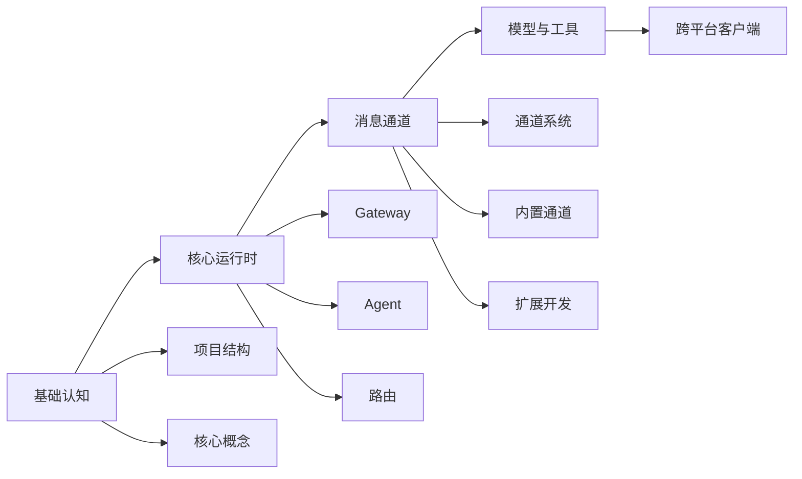
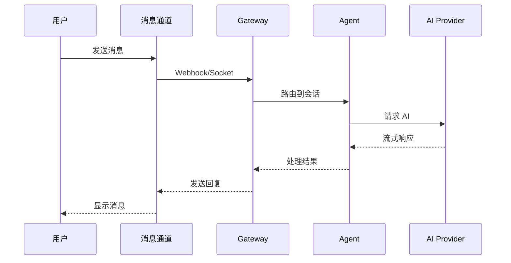

## 什么是 OpenClaw

OpenClaw 是一个**个人 AI 助手网关**。它作为中心控制平面，将各种消息通道（WhatsApp、Telegram、Slack、Discord 等 20+ 平台）连接起来，并将消息路由给 AI 智能体进行处理。

核心特性：

- **本地优先** - 数据完全掌控在自己手中
- **跨平台** - 支持 macOS、iOS、Android、Linux、Windows
- **多通道** - 20+ 消息平台统一接入
- **可扩展** - Plugin SDK 支持自定义通道和工具
- **开源免费** - MIT 许可证

## 核心学习路径

## 先记住这条主链路

## 辅助阅读入口

- [阅读地图](/reading-map)：先选路线，再决定按哪条主链路进入全书
- [版本说明](/version-notes)：确认本书基于哪份源码、写到什么边界
- [术语表](/glossary)：统一理解核心概念

> **阅读边界**：本书以当前源码实现为准，重点解释已经落在仓库里的结构、主链路和工程约束，不承诺覆盖未来版本变更。若文档与代码不一致，以当前仓库源码为准。

## 适合人群

- 想要深入理解 AI 助手架构的开发者
- 希望学习大型 TypeScript 项目的工程师
- 对跨平台开发感兴趣的技术爱好者
- 想要为 OpenClaw 贡献代码的开源贡献者
- 需要开发自定义扩展的集成工程师

## 技术栈概览

| 层级 | 技术栈 |
|------|--------|
| **核心网关** | TypeScript, Node.js 22+, Hono |
| **桌面应用** | Swift, SwiftUI, AppKit (macOS) |
| **移动应用** | Swift/SwiftUI (iOS), Kotlin (Android) |
| **消息通道** | Telegram Bot API, Discord.js, WhatsApp Web.js 等 |
| **AI 集成** | OpenAI, Anthropic, xAI, Mistral 等 30+ 提供者 |
| **扩展系统** | Plugin SDK, 自定义通道和工具 |
