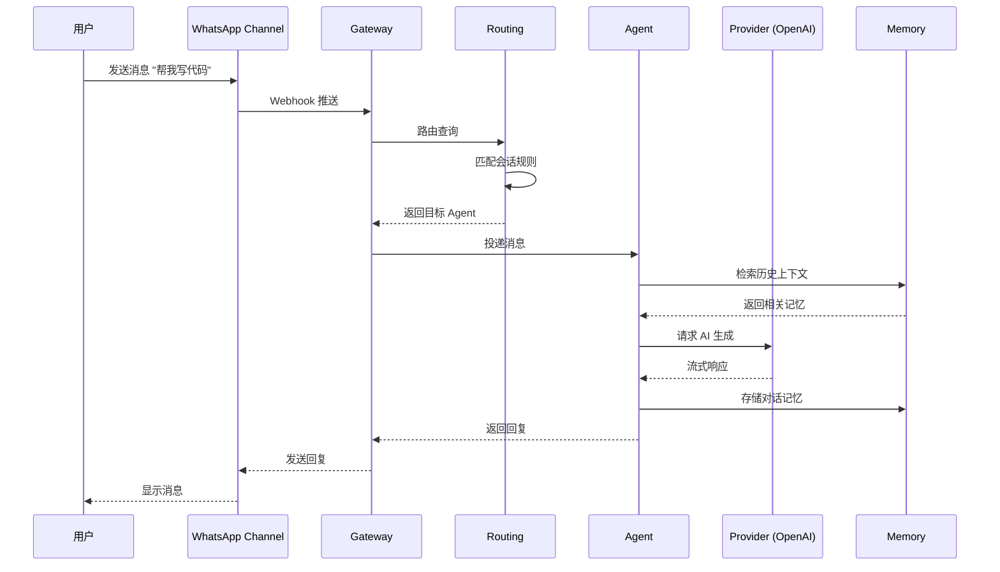

# 阅读地图

本书设计了三条阅读路线，根据你的目标和时间选择最适合的路径。

## 三条阅读路线

### 🚀 快速入门路线（2-3小时）

适合：想快速了解 OpenClaw 核心架构的读者


**阅读顺序**：
1. **第1章** - 了解 OpenClaw 是什么，解决什么问题
2. **第2章** - 掌握目录结构和模块划分
3. **第4章** - 理解消息网关的核心机制
4. **第5章** - 学习 AI 代理如何处理消息
5. **第7章** - 了解通道抽象层的设计

### 🔧 开发实战路线（8-10小时）

适合：想要开发自定义扩展的工程师


**阅读顺序**：
1. 完成**快速入门路线**
2. **第3章** - 深入理解核心概念和术语
3. **第6章** - 掌握消息路由机制
4. **第8章** - 研究内置通道实现
5. **第9章** - 学习如何开发扩展
6. **第10章** - 理解 AI 提供商集成
7. **第11章** - 掌握 Plugin SDK 使用

### 📱 跨平台开发路线（6-8小时）

适合：想要开发 macOS/iOS/Android 客户端的开发者


**阅读顺序**：
1. **第1章** - 项目概览
2. **第2章** - 理解 apps/ 目录结构
3. **第13章** - 学习跨平台架构设计
4. **第14章** - macOS 客户端实现细节
5. **第15章** - iOS/Android 客户端开发

## 章节依赖图

```mermaid
graph TD
    subgraph 第一部分：基础认知
        C1[第1章：项目介绍]
        C2[第2章：项目结构]
        C3[第3章：核心概念]
    end
    
    subgraph 第二部分：核心运行时
        C4[第4章：Gateway 网关]
        C5[第5章：Agent 代理]
        C6[第6章：消息路由]
    end
    
    subgraph 第三部分：消息通道
        C7[第7章：通道系统]
        C8[第8章：内置通道]
        C9[第9章：扩展开发]
    end
    
    subgraph 第四部分：模型与工具
        C10[第10章：Provider]
        C11[第11章：Plugin SDK]
        C12[第12章：工具系统]
    end
    
    subgraph 第五部分：跨平台客户端
        C13[第13章：客户端架构]
        C14[第14章：macOS 客户端]
        C15[第15章：移动端开发]
    end
    
    C1 --> C2
    C2 --> C3
    C3 --> C4
    C4 --> C5
    C5 --> C6
    C4 --> C7
    C7 --> C8
    C8 --> C9
    C5 --> C10
    C10 --> C11
    C11 --> C12
    C4 --> C13
    C13 --> C14
    C14 --> C15
```

## 阶段分级

| 阶段 | 章节 | 目标 | 预计时间 |
|------|------|------|----------|
| **阶段1** | 1-3章 | 建立全局认知，理解项目定位和结构 | 2小时 |
| **阶段2** | 4-6章 | 进入运行时主链路，掌握消息处理流程 | 3小时 |
| **阶段3** | 7-12章 | 理解扩展系统，学会自定义开发 | 5小时 |
| **阶段4** | 13-15章 | 跨平台客户端开发实战 | 4小时 |

## 概念→代码映射表

| 概念组件 | 对应目录/文件 | 核心作用 |
|---------|-------------|---------|
| **Gateway** | `src/gateway/` | 消息网关，WebSocket 连接管理、协议解析 |
| **Agent** | `src/agents/` | AI 代理，会话管理、LLM 调用、任务执行 |
| **Channel** | `src/channels/`, `extensions/*/` | 消息通道抽象，统一 IM 平台接口 |
| **Provider** | `src/providers/`, `extensions/*/` | AI 提供商抽象，OpenAI/Anthropic 等统一接口 |
| **Routing** | `src/routing/` | 消息路由逻辑，决定消息如何分发 |
| **Plugin SDK** | `src/plugin-sdk/` | 插件开发工具包，扩展开发 API |
| **Memory** | `src/memory/` | 记忆存储，LanceDB 向量数据库 |
| **CLI** | `src/cli/` | 命令行界面，子命令注册和执行 |
| **TUI** | `src/tui/` | 终端用户界面，交互式会话模式 |
| **Infra** | `src/infra/` | 基础设施，设备身份、网络、环境变量 |
| **Config** | `src/config/` | 配置管理，加载、验证、存储配置 |
| **OpenClawKit** | `apps/shared/OpenClawKit/` | 跨平台共享库，WebSocket 通信 |

## 主链路执行路径

> **任务**：用户通过 WhatsApp 发送消息，获得 AI 回复



**关键代码路径**：
1. `extensions/whatsapp/src/channel.ts` - 接收 WhatsApp 消息
2. `src/gateway/protocol/` - 协议解析
3. `src/routing/` - 路由决策
4. `src/agents/cli-runner.ts` - Agent 执行
5. `src/providers/` - 调用 AI API

## 如何使用本书

### 对于初学者

1. 按**快速入门路线**顺序阅读
2. 每章完成后运行对应代码示例
3. 遇到不理解的术语，查阅[术语表](/glossary)

### 对于有经验的开发者

1. 先读[第2章：项目结构](/01-structure/)建立全局认知
2. 根据兴趣跳转到对应模块章节
3. 参考[概念→代码映射表](#概念代码映射表)定位源码

### 对于贡献者

1. 阅读[第3章：核心概念](/02-concepts/)理解设计理念
2. 研究[第9章：扩展开发](/08-extensions/)学习扩展模式
3. 参考[第11章：Plugin SDK](/10-plugin-sdk/)了解 API 规范

---

> **提示**：本书基于特定 commit 版本编写，请参考[版本说明](/version-notes)确认源码版本。
